= Entwicklerdokumentation __{project_name}__
:project_name: Kleingartenanlage
:company_name: Kleingartenanlage eV.
:toc:
:toclevels: 3
:toc-title: Inhaltsverzeichnis
:toc-placement!:
:sectanchors:
:numbered:

[options="header"]
[cols="1, 3, 3"]
|===
| Version | Bearbeitungsdatum | Autor
| 0.1     | 06.11.2019        | Isabell Zorr
| 0.1.1   | 06.11.2019        | Franziska Kiel
| 0.1.2   | 09.11.2019        | Sanghyun Lee
| 0.1.3   | 09.11.2019        | Muhammad Talal Anwar
| 0.1.4   | 12.11.2019        | Isabell Zorr
| 0.1.5   | 14.11.2019        | Ylvi Bachmann
| 0.1.6   | 20.11.2019        | Isabell Zorr
| 0.1.7   | 21.11.2019        | Ylvi Bachmann
| 0.1.8   | 10.12.2019        | Muhammad Talal Anwar
| 0.2     | 17.12.2019        | Ylvi Bachmann
| 0.2.1   | 07.01.2020        | Ylvi Bachmann
| 0.2.2   | 09.01.2020        | Ylvi Bachmann
| 0.2.3   | 14.01.2020        | Ylvi Bachmann
| 0.3.0   | 16.01.2020        | Muhammad Talal Anwar
| 0.4.0   | 17.01.2020        | Isabell Zorr
|===

toc::[]

== Einführung und Ziele

=== Aufgabenstellung

Für eine Kleingartenanlage ist ein automatisiertes Verwaltungssystem für verschiedene Personengruppen zu erstellen.

Genutzt werden soll das Programm grundsätzlich von fünf Personengruppen. Das sind der Vorstand
selbst, dann die Pächter, Obmänner, die Vereinsgaststätte und zu guter Letzt noch Gäste.
Die gesamte Anlage hat insgesamt 200 Parzellen. Jede Parzelle besitzt einen Hauptpächter, es kann
aber ein Nebenpächter eingetragen werden. Darüber hinaus sollen auch die letzten beiden
Vorpächter im System gespeichert werden. Nur der Hauptpächter ist zur jährlich stattfindenden
Hauptversammlung stimmberechtigt. Jeder Pächter ist mit vollständiger Adresse, seinen
Kontaktdaten, sowie seinem bzw. ihrem Geburtstag im System erfasst.
Des Weiteren hat jede Parzelle eine bestimmte Größe, die zwischen 150 und 300m² liegt. Jede Parzelle hat einen
Wasseranschluss und einen Elektroanschluss, an denen jeweils ein Zähler installiert ist. Jeder Pächter
erhält einmal im Jahr eine Rechnung, die sich wie folgt zusammensetzt. Die Kosten für ein Jahr
errechnen sich aus variablen Preisen der Miete für die Pacht, Wasser- und Stromkosten, Mitglieds-, Haft- und Sozialbeitrag,
Rechtsschutz, Winterdienst, Aufwandspauschale und sonstigen Auslagen.
Die Pächter werden dazu im
Herbst darüber informiert, dass sie in den nächsten 2 Wochen die Zählerstände für Wasser und
Strom abzulesen und einzutragen haben. Werden keine Werte bis dahin eingetragen, soll ein
geschätzter Wert eingetragen werden. Die entstandene Rechnung soll dem Pächter unter seinem
Account zugänglich sein, eine zusätzliche Information per E‐Mail wäre aber sinnvoll. Der Vorstand soll
nach der Frist Informationen über den Gesamtverbrauch an Wasser in der Anlage erhalten, um dies
mit dem Hauptwasserzähler vergleichen zu können.

Der Vorstand selber setzt sich zusammen aus einem Vorstandsvorsitzenden, seinem Stellvertreter,
einem Protokollanten, einem für die Finanzen verantwortlichen Schatzmeister, sowie den
Obmännern. Von diesen Obmännern gibt es insgesamt acht, die sich jeweils um die Belange von 25
Gärten kümmern. Obmänner dienen dabei als eine Art Zwischenglied zwischen dem einzelnen
Pächter und dem Vorstandsvorsitz. Sie können z.B. bei kleinen Konflikten zwischen Pächtern
vermitteln, ohne sofort die höchste Instanz zu behelligen. Sie können ebenfalls eine erste Ermahnung
aussprechen, wenn ein Pächter gegen die Vereinsstatuten verstößt, indem er z.B. eine zu große
Fläche fest überdacht, dem Garten zu wenig Pflege oder der Dreiteilung (1/3 bebaut, 1/3 begrünt,
1/3 angebaut) offensichtlich widersprochen hat. Sollte der Mangel innerhalb einer vom Obmann
festgelegten Zeitspanne nicht behoben sein, wird sich der Vorstand der Sache annehmen und bei
wiederholter Uneinsicht des Pächters eine zweite Ermahnung und zu guter Letzt eine Kündigung
aussprechen. Nach der Kündigung, egal ob vom Vorstand ausgesprochen oder von selbst eingereicht,
wird die Parzelle wieder als frei angezeigt. Von da an muss der Vorpächter allerdings warten, bis sich
ein neuer Pächter findet, um evtl. materielle Werte ersetzt zu bekommen.

Jede Parzelle soll einen eigenen Login bekommen. Nach dem Anmelden sollen dem Pächter alle
wichtigen Informationen übersichtlich angezeigt werden. Es soll weiterhin möglich sein, Anträge an
den Vorstand zu stellen, bspw. Bauanträge für einen Neu‐, Um‐ oder Ausbau der Laube. Von jeder
Parzelle wird erwartet, dass sie pro Kalenderjahr vier Pflichtstunden zur Erhaltung, Pflege und
Instandhaltung der Gemeinschaftsanlagen leistet. Um ein Organisationschaos zu vermeiden, werden
vom Vorstand bis spätestens 31.03. jeden Jahres acht Termine zur Ableistung der Stunden
festgesetzt. Diese finden nur im April, Mai, Juni und September entweder an einem Freitag von 16 bis
20 Uhr oder an einem Samstag zwischen 8 und 12 Uhr statt. Pächter können sich für diese Termine
bis spätestens zwei Wochen vorher mit der von ihnen gewünschten Anzahl zu leistender Stunden
anmelden. Zu jedem Termin ist ebenfalls ein aufsichtsführender Obmann anwesend, der die zu
erledigenden Aufgaben an die Pächter verteilt und im Anschluss die geleisteten Stunden bestätigt
bzw. die tatsächlich geleisteten Stunden einträgt. Die Obmänner müssen daher nach erfolgreicher
Festlegung der Termine über diese informiert werden, damit sie sich für einen Termin eintragen
können. Da der Vorstand und die Obmänner über das Jahr verteilt mit genug Aufgaben beschäftigt
sind, müssen sie keine Pflichtstunden leisten. Werden bis zum letztmöglichen Termin nicht alle
Pflichtstunden abgeleistet, werden pro Stunde 8 Euro zur jährlichen Rechnung eines Pächters
hinzugefügt. Dabei wird auf halbe Stunden abgerundet.

Gäste benötigen keinen Login und haben nur rudimentären Zugriff auf das System. Sie können sich
Infos über geplante Veranstaltungen und Feste, wie z.B. das jährlich stattfindende Hexenbrennen
oder Gartenfest ansehen. Sie können sich ebenso eine Übersicht der freien Parzellen ansehen und
sich über ein Formular für eine oder mehrere Parzellen bewerben. Dabei sind der Name des
Interessenten sowie eine Telefonnummer und eine gültige E‐Mail‐Adresse verpflichtend anzugeben.
Freie Parzellen sind gekennzeichnet durch eine Quadratmeteranzahl, eine kurze Auflistung der auf
oder in der Parzelle befindlichen Bebauungen (wie bspw. Laube, Teich, Grill, ...) und Gehölzen, sowie
durch unabhängige Wertermittler berechneten Schätzwert, der als Ablösesumme auf
Verhandlungsbasis für den Vorpächter zu verstehen ist. Der Vorstand erhält dann bei erneuter
Anmeldung am System einen Hinweis, dass es neue Bewerber für eine oder mehrere Parzellen gibt.
Es soll neue Bewerbungen, bearbeitete Bewerbungen, angenommene Bewerbungen und gelöschte
Bewerbungen geben. So kann sich der Vorstand telefonisch mit dem oder den Bewerbern in
Verbindung setzen, um bspw. einen Besichtigungstermin auszumachen. Die Anfragen sollen so lange
bestehen bleiben, bis der Vorstand sich für einen Bewerber entschieden hat. Danach sollen alle
Bewerbungen für eine Parzelle gelöscht werden. Der Vorstand kann jedoch auch vorher eine
Bewerbung schon aus anderen Gründen löschen. Sollte der Vorstand einen passenden Bewerber für
eine Parzelle gefunden haben und Vorpächter und neuer Pächter sich mit der Ablösesumme
einverstanden erklären, wird die entsprechende Bewerbung als angenommen deklariert und alle
anderen gelöscht. Dabei könnten die bereits gemachten persönlichen Daten des neuen Pächters in
das Änderungsformular der entsprechenden Parzelle übernommen werden. Optional wäre es
sinnvoll, wenn alle abgelehnten Bewerber über eine E‐Mail darüber informiert werden, dass die
Parzelle vergeben wurde. Gäste können sich weiterhin aktuelle Termine und Veranstalltungen anschauen.

=== Qualitätsziele
[options="header"]
[cols="2h,^1,^1,^1,^1,^1"]
|===
|Qualitätsziel
|1
|2
|3
|4
|5

|Anpassbarkeit (Scalability)
|X
|
|
|
|

|Wartbarkeit (Maintainability)
|
|x
|
|
|

|Erweiterbarkeit (Extensibility)
|
|
|
|x
|

|Benutzbarkeit (Usability)
|
|x
|
|
|

|Zuverlässigkeit (Reliability)
|
|
|x
|
|

|Geschwindigkeit (Performance)
|
|
|
|
|x

|Sicherheit (Security)
|
|
|
|x
|

|===

== Randbedingungen
=== Hardware-Vorgaben
Eine Aufführung von nötigen Geräten/Hardware um diese Anwendung nutzen zu können.

* Server
* Computer
* Tastatur
* Maus

=== Software-Vorgaben
Hier folgt eine Aufführung von notwendiger Software um die Anwendung zu nutzen.
Notwendige Javaversion: +

* Java 11.0 (oder neuer)

Nutzbare Internet Browser: +

* Google Chrome
* Mozilla Firefox

=== Vorgaben zum Betrieb der Software

Dieser Abschnitt verschafft einen Überblick über die vorgesehene Nutzung des Produktes nach Fertigstellung
und unter welchen Umständen diese erfolgt.

Das System wird von den Pächtern der _{project_name}_ genutzt und dient der Übersicht der Parzelle
und dem Managen der Anlage für den Vorstand. Auch können sich Gäste über Neuigkeiten informieren und sich
auf Parzellen bewerben. Die Software läuft auf einem Server und ist für alle Nutzer 24/7 über einen
Browser erreichbar.

Die Hauptnutzer der Software werden die Pächter (tenants), die wenig bis viel Erfahrung mit Software haben,
und die Vorstandsmitglieder, die ebenfalls wenig bis viel Erfahrung im Umgang haben.

Das System soll wenig Wartung bedürfen, da die Aufwandskosten für den Vorstand zu hoch wären.
Sämtliche Daten sollten in einer Datenbank gespeichert werden und durch die Anwendung erreichbar sein.

== Kontextabgrenzung
=== Kontextdiagramm
image::models/analysis/System Context Diagram_v2.png[]
Kontextdiagramm

== Lösungsstrategie
=== Erfüllung der Qualitätsziele
[options="header"]
|===
| Qualitätsziel |Lösungsansatz

| Anpassbarkeit (Scalability)
| - Vermeidung von Codewiederholung +
- Kopieren von Funktionen

| Wartbarkeit (Maintainability)
| - Nutzung von einzelnen Packages und Komponenten +
- Sicherstellen, dass Komponenten von anderen Komponenten (wieder-) verwendet werden können

| Erweiterbarkeit (Extensibility)
| - Nutzung  von Packages und Frameworks

| Benutzbarkeit (Usability)
| - übersichtliche und benutzerfreundliche Ansichten +
- große Buttons mit verständlichen Beschriftungen +
- Übersichtsseiten der Anwendung sind mit wenigen Klicks zu erreichen

| Zuverlässigkeit (Reliability)
| Tests mit JUnit

| Sicherheit (Security)
| - Nutzung von einmaligen Passwörtern und Spring Security +
- Authorisierung von Nutzern

|===

=== Softwarearchitektur

image::models/analysis/Top Level Architechture_v2.png[]
Top-Level-Architektur

image::models/analysis/Client Server Model of the Application.png[]
Client-Server-Modell der Anwendung

=== Entwurfsentscheidungen

* Hinzufügen der Assoziationsklasse Procedure zwischen die Klassen Plot und Tenant, um die Verbindung dieser Klassen
zu modellieren und veränderliche Daten (z.B. Pächter, Wasserzähler, ...) der Parzelle für die jährliche Rechnungserstellung
zu speichern. In der finalen Anwendung erfolgt der Zugriff auf die Assoziationsklasse mit Hilfe der Klasse ProcedureManager
* Hinzufügen weiterer Packages (Bewerbungsverwaltung und Terminverwaltung), um bessere Arbeitsteilung zu erreichen, damit
Konflikte vermieden werden können

==== Verwendete Muster
* Spring MVC

==== Persistenz
Die Anwendung verwendet *Hibernate Annotation basiertes Mapping*, um Java Klassen zu den Datenbanktabellen zuordnen. Als Datenbank wird *H2* verwendet. Die Persistenz ist standardmäßig deaktiviert. Um den Persistenzspeicher zu aktivieren, müssen die folgenden zwei Zeilen in der Datei application.properties nicht auskommentiert werden:

....
# spring.datasource.url=jdbc:h2:./db/kleingarten
# spring.jpa.hibernate.ddl-auto=update
....

==== Email Service
Die Anwendung verwendet *JavaMail*, um Email zu erzeugen und schicken. Die
Email Service ist standardmäßig im Logging Modus gesetzt. Um den Service zu
aktivieren, sodass Email(s) rausgeschickt können, muss das
`app.messaging.enabled` property in der Datei `application.properties` zu
`true` geändert werden:

....
app.messaging.enabled=true
....

Darüber hinaus, müssen die folgenden drei properties entsprechend konfiguriert
werden:

....
spring.mail.username=your@email.com
spring.mail.password=secret-password
spring.mail.host=smtp.example-server.com
....

Um die Email Logging zu deaktivieren, muss das `app.messaging.logging` property
zu `false` geändert werden:

....
app.messaging.logging=false
....

==== Benutzeroberfläche
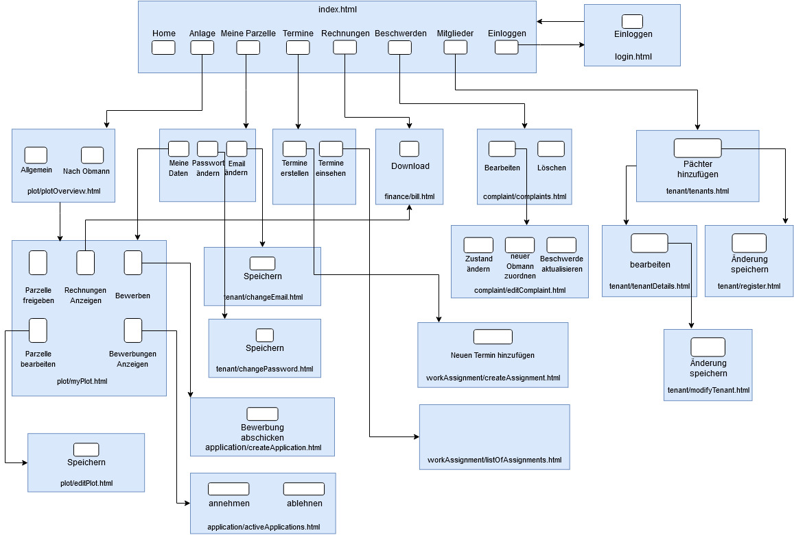

==== Verwendung externer Frameworks

[options="header", cols="1,3,3"]
|===
| Externe Klasse                  | Pfad der externen Klasse                                   | Verwendet von (Klasse der eigenen Anwendung)
| slf4j.Logger                    | org.slf4j.Logger                                          a|
* message.MessageService +
* configuration.AppDataInitializer
| slf4j.LoggerFactory             | org.slf4j.LoggerFactory                                   a|
* message.MessageService +
* configuration.AppDataInitializer
| Salespoint.AbstractEntity       | org.salespointframework.core.AbstractEntity                | finance.Fee
| Salespoint.AuthenticationManager | org.salespointframework.useraccount.AuthenticationManager | tenant.TenantService
| Salespoint.Catalog              | org.salespointframework.catalog.Catalog                   a|
* plot.PlotCatalog
| Salespoint.DataInitializer      | org.salespointframework.core.DataInitializer               | configuration.AppDataInitializer
| Salespoint.Product              | org.salespointframework.catalog.Product                    | plot.Plot
| Salespoint.ProductIdentifier    | org.salespointframework.catalog.ProductIdentifier         a|
* plot.PlotControllerService
* plot.PlotInformationBuffer
* plot.PlotService
* plot.SecurePlotController
* plot.UpdateChairmanForm
| Salespoint.Password             | org.salespointframework.useraccount.Password               a|
 * tenant.TenantService +
 *  tenant.TenantManager +
| Salespoint.Role                 | org.salespointframework.useraccount.Role                  a|
* tenant.Tenant +
* tenant.TenantManager +
* tenant.TenantRole +
* complaint.ComplaintController
* plot.PlotControllerService
* plot.PlotService
* plot.SecurePlotController
| Salespoint.SalespointIdentifier | org.salespointframework.core.SalespointIdentifier          | finance.Fee
| Salespoint.UserAccount          | org.salespointframework.useraccount.UserAccount           a|
* tenant.Tenant +
* complaint.ComplaintController
* plot.InsecurePlotController
* plot.PlotControllerService
* plot.SecurePlotController
| Salespoint.UserAccountManager   | org.salespointframework.useraccount.UserAccountManager     | tenant.TenantManager
| Spring.Assert                   | org.springframework.util.Assert                           a|
* news.NewsEntry +
* news.NewsController +
* tenant.TenantController +
* tenant.TenantManager +
* complaint.Complaint +
* complaint.ComplaintController +
* complaint.ComplaintManager +
* configuration.AppDataInitializer
| Salespoint.Currencies           | org.salespointframework.core.Currencies.EURO              a|
* plot.Plot
* plot.SecurePlotController
| Spring.CrudRepository           | org.springframework.data.repository.CrudRepository        a|
* news.NewsRepository +
* tenant.TenantRepository +
* finance.FeeCatalog +
* complaint.ComplaintRepository
| Spring.ConfigurationProperties  | org.springframework.boot.context.properties.ConfigurationProperties | message.MessageProperties
| Spring.SimpleMailMessage        | org.springframework.mail.SimpleMailMessage                 | message.MessageService
| Spring.MimeMessageHelper        | org.springframework.mail.javamail.MimeMessageHelper        | message.MessageService
| Spring.JavaMailSender           | org.springframework.mail.javamail.JavaMailSender           | message.MessageService
| Spring.Model                    | org.springframework.ui.Model                              a|
* finance.FeeController +
* news.NewsController +
* plot.InsecurePlotController +
* plot.PlotControllerService
* plot.SecurePlotController
* tenant.tenantController +
* complaint.ComplaintController
| Spring.ModelAndView             | org.springframework.web.servlet.ModelAndView               a|
* plot.InsecurePlotController
* plot.PlotControllerService
* plot.SecurePlotController
| Spring.Streamable               | org.springframework.data.util.Streamable                  a|
* tenant.TenantManager +
* finance.FeeCatalog +
* complaint.ComplaintManager +
* complaint.ComplaintRepository
* plot.PlotCatalog
| Spring.Sort                     | org.springframework.data.domain.Sort                       | plot.PlotCatalog
|===

== Bausteinsicht

=== Pächterverwaltung
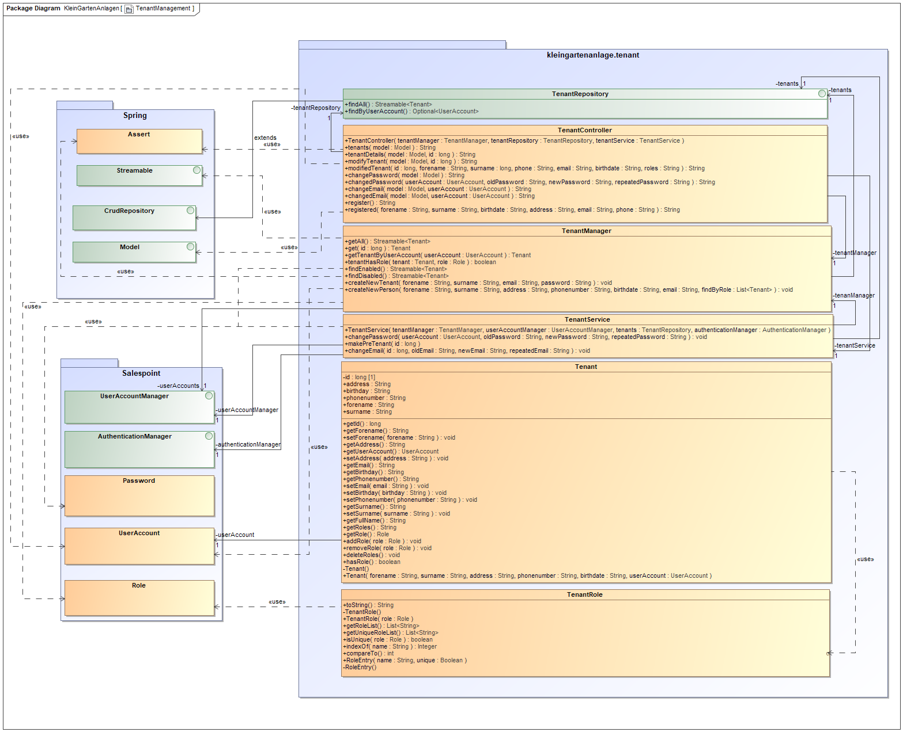

[options="header"]
|===
|Klasse/Enumeration |Description

|Tenant
|Die Pächerklasse beschreibt den Pächter der Parzelle
|TenantController
|Ein Spring MVC Controller um neue Pächter hinzuzufügen und bereits bestehende anzuzeigen und zu bearbeiten

|TenantManager
|Serviceklasse um Pächter zu managen

|TenantRepository
|Ein Repositoryinterface um Pächterinstanzen zu speichern

|===

=== Parzellenverwaltung
image::models/analysis/PlotManagement.png[Parzellenverwaltung]

[options="header"]
|===
|Klasse/Enumeration |Description
|Plot
|beschreibt die Parzelle mit ihren benötigten Daten

|PlotService und DataService
|Managementklassen, beinhalten Methoden, die mit externen Klassen interagieren und erhaltene Informationen zur Nutzung aufbereiten

|SecurePlotController
|Controller, welcher alle Anfragen bearbeitet, wenn ein Nutzer angemeldet ist

|InsecurePlotController
|Controller, welcher alle Anfragen bearbeitet, wenn kein Nutzer angemeldet ist

|PlotControllerService
|Managementklasse, welche Methoden enthält, um die in den Controllern benötigten Funktionalitäten und Informationen auszulagern

|PlotInformationBuffer
|Hilfsklasse, welche alle Informationen einer Parzelle speichert, um diese zur übersichtlich darstellen zu können
|===

Aus Gründen der Übersichtlichkeit bzw. um die primäre Richtung des Zugriffes darzustellen, wurde die Klasse Procedure in
das Package finance ausgelagert und die gerichtete Assoziation von einer Parzelle zu den zugehörigen Bewerbungen
(vom Typ Appointment) gelöscht.

=== Finanzverwaltung
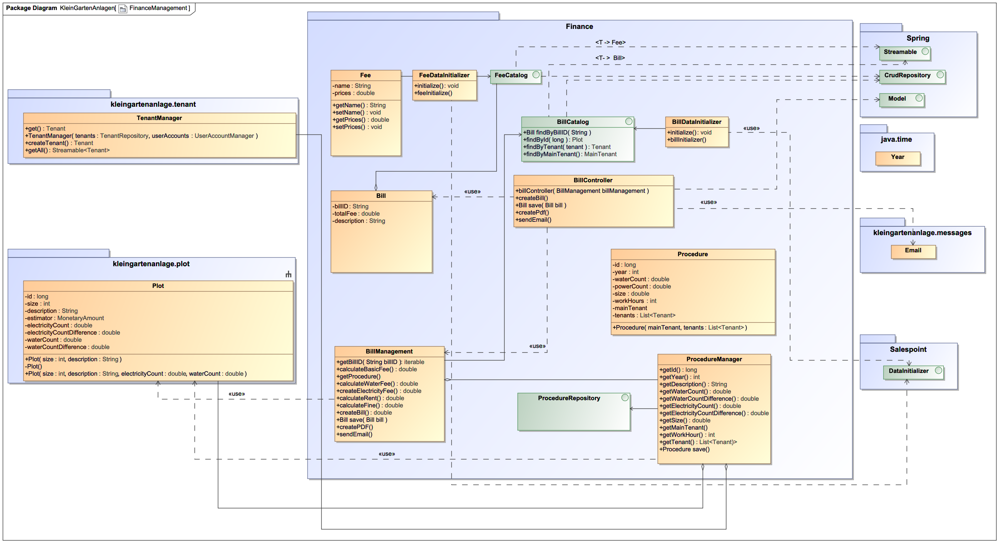

[options="header"]
|===
|Klasse/Enumeration |Description
|Fee
|Die Fee Klasse beschreibt den Basispreis der Parzelle mit benötigen Daten

|Procedure
|Procedure Klasse beschreibt alle benötige Attribute, die von Plot- und TenantManager erhalten werden

|ProcedureManagement
|ProcedureManagement Klasse ist verantwortlich für die Verwaltung der Procedure

|ProcedureController
|Die ProcedureController Klasse ist verantwortlich für die Aufrufe der verschiedene (Html) Seiten

|ProcedureRepository
|ProcedureRepository verwaltet alle empfangene Dateien von Plot- und TenantManager

|Bill
|Die Bill Klasse beschreibt eine jährliche Rechnung mit benötigen Information

|FeeController
|Die FeeController Klasse ist verantwortlich für die Aufrufe der verschiedene (Html) Seiten.
 Beispielsweise die Übersicht der jahresabrechnung von einer bestimmten Parzelle,
 die jahresabrechnung in PDF erstellen,
 und die jahresabrechnung per Email schicken

|===

=== News
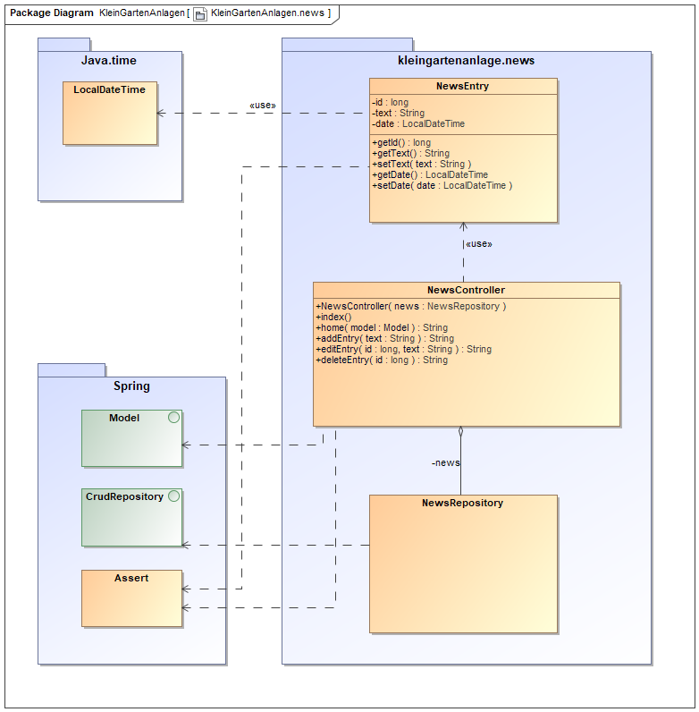

=== Bewerbungen
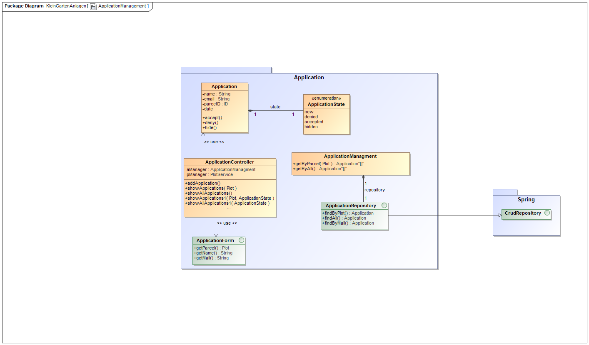

=== Nachrichtensystem
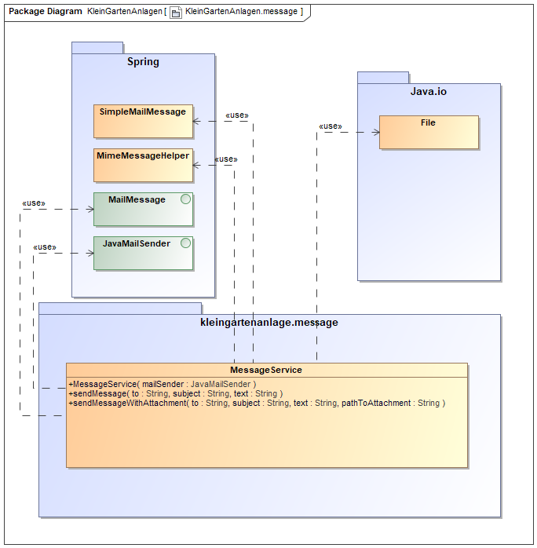

=== Termine
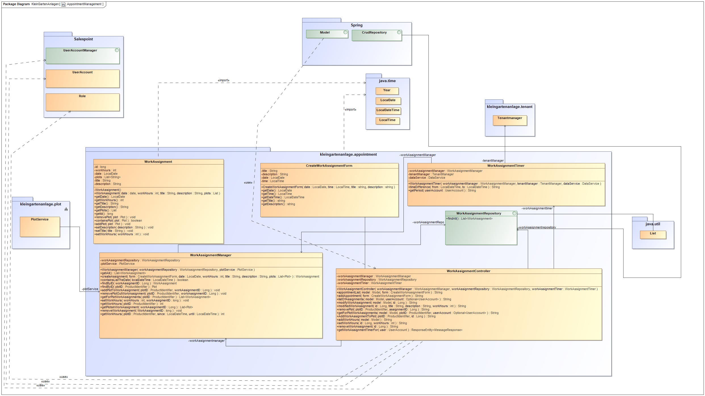

[options="header"]
|===
| Klasse/Enumeration | Description
| Appointment            | Die Appointment Klasse beschreibt einen Termin.
| AppointmentController  | Die AppointmentController Klasse ist verantwortlich für das Erzeugen, Löschen und Bearbeiten eines Termins.
| AppointmentManager | Der AppointmentManager ist verantwortlich für die Aufbewahrung und Verwaltung der Termine.
|===

=== Beschwerden
image::models/analysis/ComplainsManagement.png[]
[options="header]
|===
| Klasse/Enumeration | Description
| Complaint | Die Complaint Klasse beschreibt eine Beschwerde
| ComplaintController | Klasse zum Bauen der Seiten für das Erstellen, Bearbeiten und Löschen einer Beschwerde
| ComplaintManager | Klasse zum Aufbewahren und Verwalten der Beschwerden
|===

== Rückverfolgbarkeit zwischen Analyse- und Entwurfsmodell

[options="header"]
|===
|Klasse/Enumeration (Analysemodell) |Klasse/Enumeration (Entwurfsmodell) |Beschreibung
|<Enumeration> +
  PÄCHTER              |-           |Hinzufügen der Assoziationsklasse Procedure
|Vorpächter            |-           |Speicherung der Pächter einer Parzelle als Attribute in Procedure
|Zähler                |-           |Speicherung der Zählerstände als Attribute in Procedure
|===

== Laufzeitsicht
=== Parzellenmanagement

Aus Gründen der Übersichtlichkeit wurden in den folgenden Sequenzdiagrammen nur Interaktionen mit Salespoint und Spring
berücksichtigt, welche innerhalb der Methoden der Controller des Parzellenmanagement Packages stattfinden.
Falls weitere Informationen zum Verständnis des Workflows benötigt werden, sind diese entweder in das jeweilige
Sequenzdiagramm oder dessen Beschreibungstext integriert.

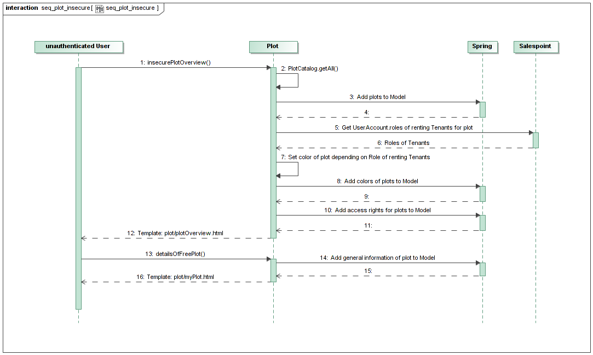

Ein nicht authentifizierter Nutzer lässt sich zuerst die Übersichtsseite aller Parzellen und danach die Detailseite einer
bestimmten Parzelle anzeigen. +
Für einen angemeldeten Pächter werden beim Aufruf der Übersichtsseite der Parzellen ebenfalls die Schritte 1 bis 12
ausgeführt. Die Zugriffsrechte für die Informationsseiten der Parzellen werden in diesem Fall anhand der Rolle
(entnommen aus Salespoint; gespeichert in der Klasse UserAccount) des angemeldeten Pächters festgelegt und zum Model
hinzugefügt. +

In den folgenden Sequenzdiagrammen wird vor jedem Methodenaufruf anhand des angemeldeten UserAccounts
(entnommen aus Salespoint) der zugehörige Pächter ermittelt, welcher gerade den jeweiligen Workflow durchführt.

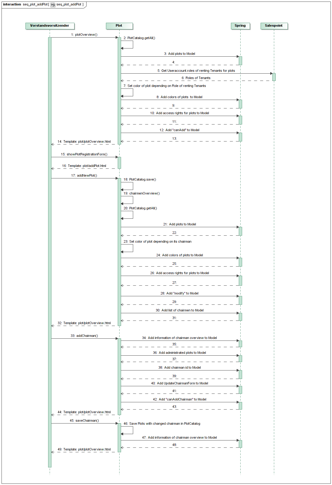

Ein authentifizierter Nutzer lässt sich die Übersichtsseite aller Parzellen anzeigen, fügt eine weitere Parzelle
hinzu und legt anschließend für diese einen Pächter mit der Rolle "Obmann" (administrativer Verwalter) fest. +
Der dargestellte Workflow kann nur durch einen Pächter mit der Rolle "Vorstandsvorsitzender" oder "Stellvertreter"
durchgeführt werden. +
Für einen angemeldeten Pächter mit einer anderen Rolle werden beim Aufruf der Übersichtsseite der Parzellen die Schritte
12 und 13 nicht ausgeführt.

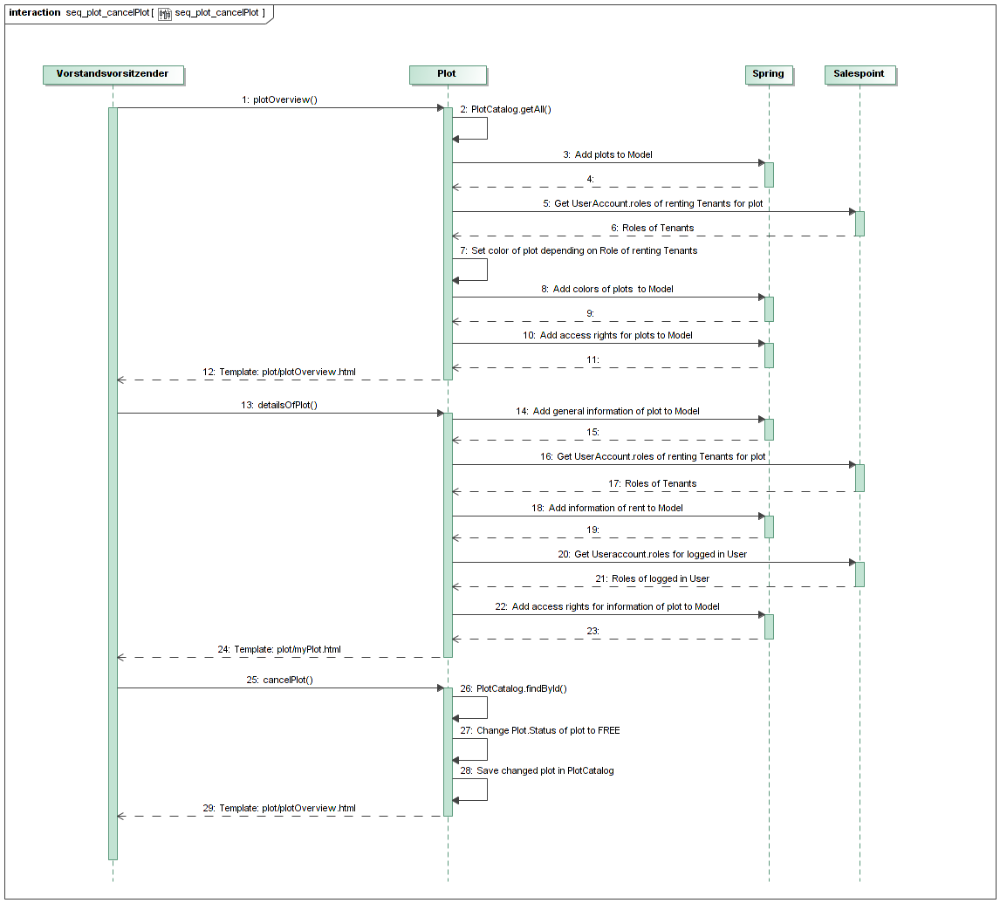

Ein authentifizierter Nutzer lässt sich zuerst die Übersichtsseite aller Parzellen, danach die Detailseite einer
bestimmten gemieteten Parzelle anzeigen und beendet den bestehenden Mietvertrag. Die Parzelle steht somit zur Bewerbung
frei. +
Der dargestellte Workflow kann nur durch einen Pächter mit der Rolle "Vorstandsvorsitzender" oder "Stellvertreter"
durchgeführt werden. +
Beim Aufruf der Detailseite einer Parzelle (Schritte 13 bis 24) werden anhand der Rolle des angemeldeten Pächters die
Zugriffsrechte auf die Informationen der Parzelle (z.B. geleistete Arbeitstunden, aktueller Mieter) und
Bearbeitungsrechte festgelegt. +
Dieser Ablauf findet für alle angemeldeten Pächter nach dem selben Schema statt.

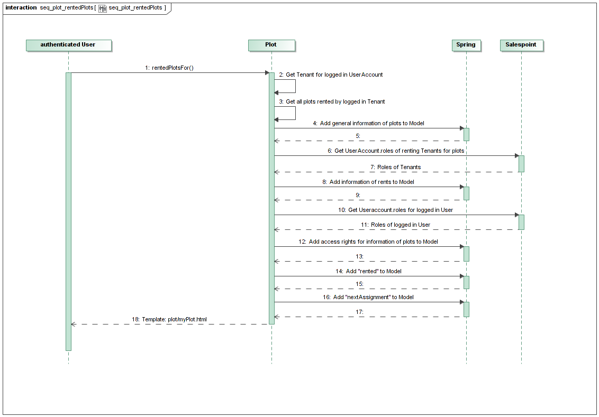

Ein authentifizierter Nutzer lässt sich alle aktuell von ihm gemieteten Parzellen anzeigen. Es wird dabei ein Timer bis
zum nächsten Termin, für den der Pächter angemeldet ist erstellt und dargestellt. +
Durch die Überprüfung der Rollen des Pächters in den Schritten 10 und 11 können nach Bedarf erweiterte Bearbeitungsrechte
(z.B. Eintragen des Wasserzählerstands, Freigeben der Parzelle) festgelegt werden.

=== Pächtermanagement

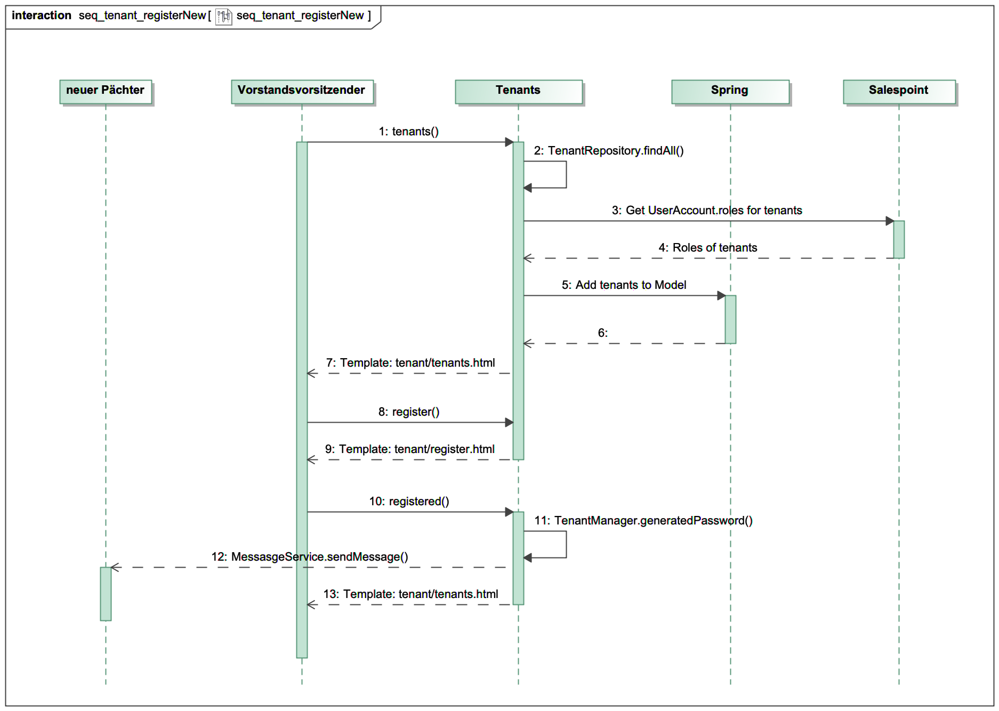

Der Vorstandsvorsitzender navigiert zuerst auf die Übersichtsseite ("Mitglieder") aller Pächter und betätigt den Button
"Pächter hinzufügen". +
Nun erscheint ein Formular zum Aussfüllen. Hier füllt er die erbetenen Daten aus und betätigt "Pächter hinzufügen".
Ein neuer Pächter ohne Rollen wurde hinzugefügt.

image::models/analysis/seq_tenant_editTenant.png[Workflow zum Bearbeiten eines Pächters]
Der Vorstandsvorsitzender navigiert zuerst auf die Übersichtsseite ("Mitglieder") aller Pächter und klickt auf den Namen
oder die Email eines Pächters. So gelangt er auf die Detailseite dieses Pächters mit allen gespeicherten Informationen,
wie "Adresse", "Geburtstag", "Rollen", "Telefonnummer".
Klickt er jetzt auf den Stift-Button, erscheint ein vorausgefülltes Formular mit den Daten des Pächters, welche jetzt
bearbeitet werden können. Über Checkboxen können jetzt auch Rollen entfernt und hinzugefügt werden. +
Betätigt er nun den Button "Änderungen speichern" werden diese Änderungen gespeichert und er gelangt wieder auf die
Detailseite.

=== Finanzmanagement

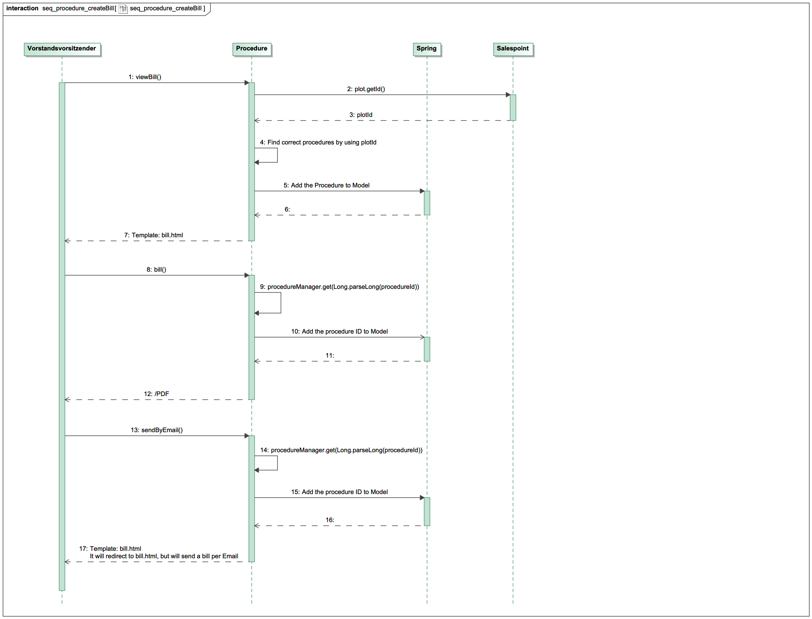

Der Vorstandsvorsitzender/Mieter navigiert zuerst auf die Seite, "Meine Parzelle" - "Meine Daten". In der "Option Knopf"
 kann er "Rechnung anzeigen" finden. Wenn er den klickt, kann alle Jahresabrechnungen von seiner Parzelle. Bei Klicken
kann er diese Jahresabrechnungen in PDF herunterladen oder kann er diese Rechnungen per Email abschicken.

=== News

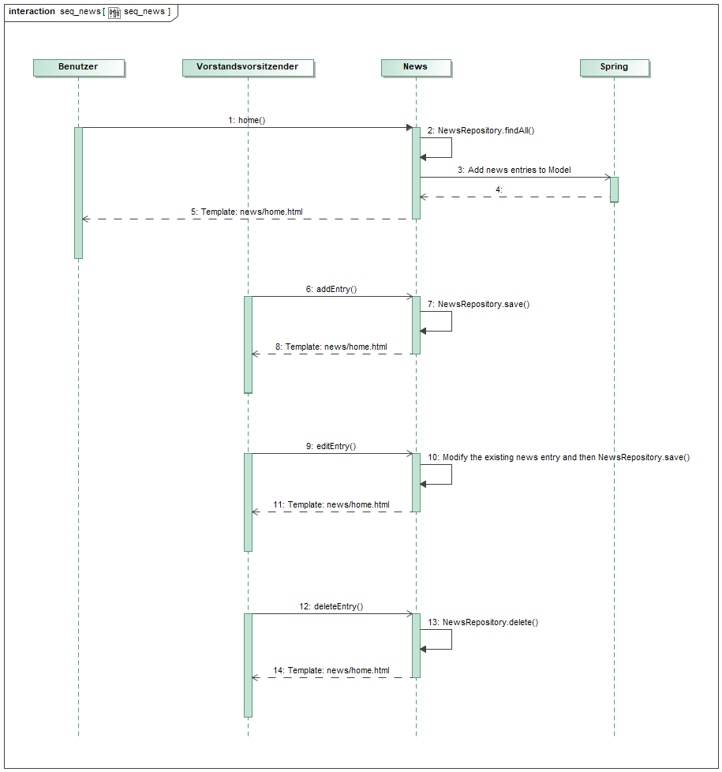

=== Beschwerden

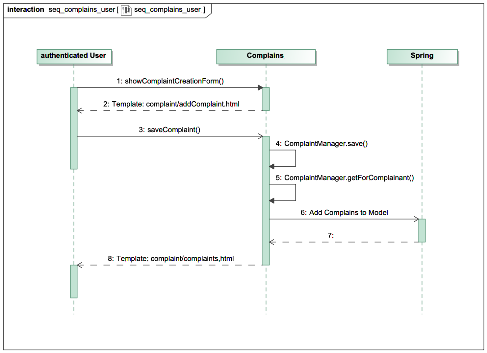

Im Diagramm wird der Workflow zur Erstellung einer Beschwerde durch einen eingeloggten Nutzer beschrieben. Dieser
navigiert zunächst über die Ansicht der Parzellen zur Detailseite einer Parzelle über die er eine Beschwerde verfassen
möchte (nicht im Diagramm abgebildet, aufgrund zu hoher Komplexität im Diagramm). Dort navigiert er über das auf der
Seite befindliche Drop-Down-Menü auf "Beschwerde verfassen". Hier gelangt er nun zum Formular zur Erstellung einer Beschwerde.
Nach dem Ausfüllen aller Felder, geht er auf Beschwerde abschicken. Diese wird gespeichert und er gelangt zur Übersichtsseite
seiner Beschwerden, die er verfasst hat. Hat er noch keine Beschwerden verfasst, ist die Liste leer.

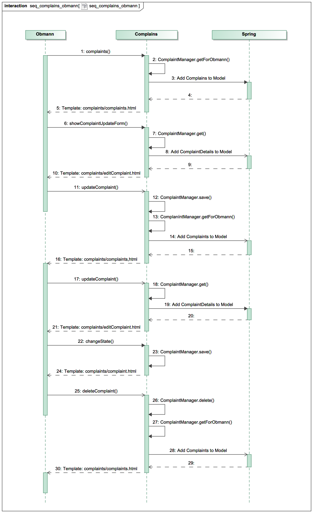

Dieses Diagramm beschreibt den Ablauf der Bearbeitung und Verwaltung der Beschwerden durch einen Obmann oder den
Vorstandsvorsitzenden/Stellvertreter (im Diagramm nur durch den Obmann repräsentiert). Über den Reiter "Beschwerden"
erhält der Obmann alle ihm zugeordneten Beschwerden. Der Vorstandsvorsitzende und der Stellvertreter sehen eine
Übersicht aller Beschwerden. Hier hat der Obmann nun die Möglichkeit die Beschwerden zu Bearbeiten, einzusehen, von
wem sie gestellt wurden und was die Gründe waren. Nachdem er sich abseits der Software um diese gekümmert hat, kann er
ihren Status auf "FINISHED" setzen, um die Abarbeitung der Beschwerde zu verdeutlichen. Dies kann auch der Nutzer sehen,
der die Beschwerde verfasste. Dem Vorstandsvorsitzendem und dem Stellvertreter obliegt die Möglichkeit Beschwerden zu löschen.

== Technische Schulden

=== JavaDoc

Im gesamten Package Application fehlen die JavaDoc-Kommentare für die Methoden. Dieses Package wurde Sascha Seiffert
zugeteilt, der dieser Aufgabe bis zur Abgabe nicht nachkam.

=== Quality Gates
Bewertung: A (sehr gut) bis E (sehr schlecht) +
Alle in SonarQube voreingestellten Quality Gates werden von der Anwendung mit der Bewertung A erfüllt.
Diese Ziele sind Zuverlässigkeit (Reliability), Sicherheit (Security), Wartbarkeit (Maintainability).
Darüber hinaus enthält die Anwendung 0,0% duplizierte Codezeilen und die Testabdeckung liegt über dem eingestellten
minimalen Prozentsatz.

=== SonarQube Issues
Hier werden alle SonarQube issues aufgeführt, welche die Priorität *Blocker*, *Critical* oder *Major* besitzen,
darüber hinaus auch häufige *Minor*-Issues.

[options="header"]
[options="header", cols="1, 2, 2, 2"]
|===
|Priority |Beschreibung |Vorkommen |entsprechendes Quality Gate
|Minor |Zeilen sollen nicht länger sein als 120 Zeichen|
- 1 Vorkommen in ApplicationController |Keines
|Minor |fehlende geschweifte Klammer |
- 2 Vorkommen in ApplicationManager
- 11 Vorkommen in Procedure
- 4 Vorkommen in ProcedureManager |Keines
|Minor |zwei Statements in einer Zeile|
- 1 Vorkommen in ApplicationManager
- 11 Vorkommen in Procedure
- 4 Vorkommen in ProcedureManager|Keines
|Critical|zu hohe kognitive Komplexität |
- 1 Vorkommen in ProcedureController | Wartbarkeit
|Major |zu viele return in einer Methode |
- 1 Vorkommen in ProcedureController | Wartbarkeit
|Major |ungenutzter Parameter |
- 1 Vorkommen in ProcedureManager | Wartbarkeit
|===

=== Parzellenmanagement
Feedback aus dem Cross Test, welches nicht berücksichtigt wurde
[options="header"]
|===
|Nummer |Pfad |Parameter |Beschreibung |Rückgabe
|1| Anlage | Rolle:Obmann | - |White Label Page
|2| /myPlot | Logged in as: peter.klaus@email.com | Nach Freigabe des eigenen Kleingartens wird dieser immer noch unter "Meine Daten" angezeigt | -
|===

__Begründung:__

- 1: Fehler konnte leider nicht reproduziert werden.
- 2: Nach Absprache mit dem Tutor soll ein Pächter so lange noch Zugriff auf seine gekündigte Parzelle haben, bis eine
     Bewerbung eines neuen Pächters für diese Parzelle angenommen wurde.

Des Weiteren wurde die Funktionalität Nebenpächter für eine gemietete Parzelle hinzuzufügen bzw. diese Pächter zu bearbeiten
nicht vollständig implementiert. Mit dieser Aufgabe und der Anzeige des benötigten Formulars auf der Bearbeitungsseite
einer Parzelle (editPlot.html) wurde Sascha Seiffert beauftragt.

=== Bewerbungen
Feedback aus dem Cross Test, welches nicht berücksichtigt wurde

Die Funktionalitäten Vorstand kann Bewerbungen bearbeiten, annehmen, löschen und ablehnen sind nicht vollständig implementiert.
Mit dieser Aufgabe wurde Sascha Seiffert beauftragt, der seit Anfang des Jahres nicht mehr aktiv am Projekt arbeitet,
ohne das Team darüber informiert zu haben.

=== Pächtermanagement
Feedback aus dem Cross Test, welches nicht berücksichtigt wurde
[options="header"]
|===
|Nummer |Pfad |Parameter |Beschreibung |Rückgabe
| 1 | /login | Email: "s.krimse@gmaile.com"; Passwort: "123" | kein Login möglich | redirect: /login?error
|===

__Begründung:__

- 1: Email wurde für das Cross Testing falsch abgeschrieben.
