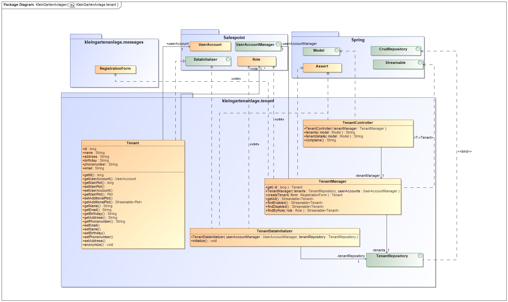

= Entwicklerdokumentation __{project_name}__
:project_name: Kleingartenanlage
:company_name: Kleingartenanlage eV.
:toc:
:toclevels: 3
:toc-title: Inhaltsverzeichnis
:toc-placement!:
:sectanchors:
:numbered:

[options="header"]
[cols="1, 3, 3"]
|===
| Version | Bearbeitungsdatum | Autor
| 0.1     | 06.11.2019        | Isabell Zorr
| 0.1.1   | 06.11.2019        | Franziska Kiel
| 0.1.2   | 09.11.2019        | Sanghyun Lee
| 0.1.3   | 09.11.2019        | Muhammad Talal Anwar
| 0.1.4   | 12.11.2019        | Isabell Zorr
| 0.1.5   | 14.11.2019        | Ylvi Bachmann

|===

toc::[]

== Einführung und Ziele

=== Aufgabenstellung

Für eine Kleingartenanlage ist ein automatisiertes Verwaltungssystem für verschiedene Personengruppen zu erstellen.

Genutzt werden soll das Programm grundsätzlich von fünf Personengruppen. Das sind der Vorstand
selbst, dann die Pächter, Obmänner, die Vereinsgaststätte und zu guter Letzt noch Gäste.
Die gesamte Anlage hat insgesamt 200 Parzellen. Jede Parzelle besitzt einen Hauptpächter, es kann
aber ein Nebenpächter eingetragen werden. Darüber hinaus sollen auch die letzten beiden
Vorpächter im System gespeichert werden. Nur der Hauptpächter ist zur jährlich stattfindenden
Hauptversammlung stimmberechtigt. Jeder Pächter ist mit vollständiger Adresse, seinen
Kontaktdaten, sowie seinem bzw. ihrem Geburtstag im System erfasst.
Des Weiteren hat jede Parzelle eine bestimmte Größe, die zwischen 150 und 300m² liegt. Jede Parzelle hat einen
Wasseranschluss und einen Elektroanschluss, an denen jeweils ein Zähler installiert ist. Jeder Pächter
erhält einmal im Jahr eine Rechnung, die sich wie folgt zusammensetzt. Die Kosten für ein Jahr
errechnen sich aus variablen Preisen der Miete für die Pacht, Wasser- und Stromkosten, Mitglieds-, Haft- und Sozialbeitrag,
Rechtsschutz, Winterdienst, Aufwandspauschale und sonstigen Auslagen.
Die Pächter werden dazu im
Herbst darüber informiert, dass sie in den nächsten 2 Wochen die Zählerstände für Wasser und
Strom abzulesen und einzutragen haben. Werden keine Werte bis dahin eingetragen, soll ein
geschätzter Wert eingetragen werden. Die entstandene Rechnung soll dem Pächter unter seinem
Account zugänglich sein, eine zusätzliche Information per E‐Mail wäre aber sinnvoll. Der Vorstand soll
nach der Frist Informationen über den Gesamtverbrauch an Wasser in der Anlage erhalten, um dies
mit dem Hauptwasserzähler vergleichen zu können.

Der Vorstand selber setzt sich zusammen aus einem Vorstandsvorsitzenden, seinem Stellvertreter,
einem Protokollanten, einem für die Finanzen verantwortlichen Schatzmeister, sowie den
Obmännern. Von diesen Obmännern gibt es insgesamt acht, die sich jeweils um die Belange von 25
Gärten kümmern. Obmänner dienen dabei als eine Art Zwischenglied zwischen dem einzelnen
Pächter und dem Vorstandsvorsitz. Sie können z.B. bei kleinen Konflikten zwischen Pächtern
vermitteln, ohne sofort die höchste Instanz zu behelligen. Sie können ebenfalls eine erste Ermahnung
aussprechen, wenn ein Pächter gegen die Vereinsstatuten verstößt, indem er z.B. eine zu große
Fläche fest überdacht, dem Garten zu wenig Pflege oder der Dreiteilung (1/3 bebaut, 1/3 begrünt,
1/3 angebaut) offensichtlich widersprochen hat. Sollte der Mangel innerhalb einer vom Obmann
festgelegten Zeitspanne nicht behoben sein, wird sich der Vorstand der Sache annehmen und bei
wiederholter Uneinsicht des Pächters eine zweite Ermahnung und zu guter Letzt eine Kündigung
aussprechen. Nach der Kündigung, egal ob vom Vorstand ausgesprochen oder von selbst eingereicht,
wird die Parzelle wieder als frei angezeigt. Von da an muss der Vorpächter allerdings warten, bis sich
ein neuer Pächter findet, um evtl. materielle Werte ersetzt zu bekommen.

Jede Parzelle soll einen eigenen Login bekommen. Nach dem Anmelden sollen dem Pächter alle
wichtigen Informationen übersichtlich angezeigt werden. Es soll weiterhin möglich sein, Anträge an
den Vorstand zu stellen, bspw. Bauanträge für einen Neu‐, Um‐ oder Ausbau der Laube. Von jeder
Parzelle wird erwartet, dass sie pro Kalenderjahr vier Pflichtstunden zur Erhaltung, Pflege und
Instandhaltung der Gemeinschaftsanlagen leistet. Um ein Organisationschaos zu vermeiden, werden
vom Vorstand bis spätestens 31.03. jeden Jahres acht Termine zur Ableistung der Stunden
festgesetzt. Diese finden nur im April, Mai, Juni und September entweder an einem Freitag von 16 bis
20 Uhr oder an einem Samstag zwischen 8 und 12 Uhr statt. Pächter können sich für diese Termine
bis spätestens zwei Wochen vorher mit der von ihnen gewünschten Anzahl zu leistender Stunden
anmelden. Zu jedem Termin ist ebenfalls ein aufsichtsführender Obmann anwesend, der die zu
erledigenden Aufgaben an die Pächter verteilt und im Anschluss die geleisteten Stunden bestätigt
bzw. die tatsächlich geleisteten Stunden einträgt. Die Obmänner müssen daher nach erfolgreicher
Festlegung der Termine über diese informiert werden, damit sie sich für einen Termin eintragen
können. Da der Vorstand und die Obmänner über das Jahr verteilt mit genug Aufgaben beschäftigt
sind, müssen sie keine Pflichtstunden leisten. Werden bis zum letztmöglichen Termin nicht alle
Pflichtstunden abgeleistet, werden pro Stunde 8 Euro zur jährlichen Rechnung eines Pächters
hinzugefügt. Dabei wird auf halbe Stunden abgerundet.

Gäste benötigen keinen Login und haben nur rudimentären Zugriff auf das System. Sie können sich
Infos über geplante Veranstaltungen und Feste, wie z.B. das jährlich stattfindende Hexenbrennen
oder Gartenfest ansehen. Sie können sich ebenso eine Übersicht der freien Parzellen ansehen und
sich über ein Formular für eine oder mehrere Parzellen bewerben. Dabei sind der Name des
Interessenten sowie eine Telefonnummer und eine gültige E‐Mail‐Adresse verpflichtend anzugeben.
Freie Parzellen sind gekennzeichnet durch eine Quadratmeteranzahl, eine kurze Auflistung der auf
oder in der Parzelle befindlichen Bebauungen (wie bspw. Laube, Teich, Grill, ...) und Gehölzen, sowie
durch unabhängige Wertermittler berechneten Schätzwert, der als Ablösesumme auf
Verhandlungsbasis für den Vorpächter zu verstehen ist. Der Vorstand erhält dann bei erneuter
Anmeldung am System einen Hinweis, dass es neue Bewerber für eine oder mehrere Parzellen gibt.
Es soll neue Bewerbungen, bearbeitete Bewerbungen, angenommene Bewerbungen und gelöschte
Bewerbungen geben. So kann sich der Vorstand telefonisch mit dem oder den Bewerbern in
Verbindung setzen, um bspw. einen Besichtigungstermin auszumachen. Die Anfragen sollen so lange
bestehen bleiben, bis der Vorstand sich für einen Bewerber entschieden hat. Danach sollen alle
Bewerbungen für eine Parzelle gelöscht werden. Der Vorstand kann jedoch auch vorher eine
Bewerbung schon aus anderen Gründen löschen. Sollte der Vorstand einen passenden Bewerber für
eine Parzelle gefunden haben und Vorpächter und neuer Pächter sich mit der Ablösesumme
einverstanden erklären, wird die entsprechende Bewerbung als angenommen deklariert und alle
anderen gelöscht. Dabei könnten die bereits gemachten persönlichen Daten des neuen Pächters in
das Änderungsformular der entsprechenden Parzelle übernommen werden. Optional wäre es
sinnvoll, wenn alle abgelehnten Bewerber über eine E‐Mail darüber informiert werden, dass die
Parzelle vergeben wurde. Gäste können sich weiterhin aktuelle Termine und Veranstalltungen anschauen.

=== Qualitätsziele
[options="header"]
[cols="2h,^1,^1,^1,^1,^1"]
|===
|Qualitätsziel
|1
|2
|3
|4
|5

|Anpassbarkeit (Scalability)
|X
|
|
|
|

|Wartbarkeit (Maintainability)
|
|x
|
|
|

|Erweiterbarkeit (Extensibility)
|
|
|
|x
|

|Benutzbarkeit (Usability)
|
|x
|
|
|

|Zuverlässigkeit (Reliability)
|
|
|x
|
|

|Geschwindigkeit (Performance)
|
|
|
|
|x

|Sicherheit (Security)
|
|
|
|x
|

|===

== Randbedingungen
=== Hardware-Vorgaben
Eine Aufführung von nötigen Geräten/Hardware um diese Anwendung nutzen zu können.

* Server
* Computer
* Tastatur
* Maus

=== Software-Vorgaben
Hier folgt eine Aufführung von notwendiger Software um die Anwendung zu nutzen.
Notwendige Javaversion: +

* Java 11.0 (oder neuer)

Nutzbare Internet Browser: +

* Google Chrome
* Mozilla Firefox

=== Vorgaben zum Betrieb des Software

Dieser Abschnitt verschafft einen Überblick über die vorgesehene Nutzung des Produktes nach Fertigstellung
und unter welchen Umständen diese erfolgt.

Das System wird von den Pächtern der _{project_name}_ genutzt und dient der Übersicht der Parzelle
und dem Managen der Anlage für den Vorstand. Auch können sich Gäste über Neuigkeiten informieren und sich
auf Parzellen bewerben. Die Software läuft auf einem Server und ist für alle Nutzer 24/7 über einen
Browser erreichbar.

Die Hauptnutzer der Software werden die Pächter (tenants), die wenig bis viel Erfahrung mit Software haben,
und die Vorstandsmitglieder, die ebenfalls wenig bis viel Erfahrung im Umgang haben.

Das System soll wenig Wartung bedürfen, da die Aufwandskosten für den Vorstand zu hoch wären.
Sämtliche Daten sollten in einer Datenbank gespeichert werden und durch die Anwendung erreichbar sein.

== Kontextabgrenzung
=== Kontextdiagramm
image::models/analysis/System Context Diagram_v2.png[]
Kontextdiagramm

== Lösungsstrategie
=== Erfüllung der Qualitätsziele
[options="header"]
|===
|Qualitätsziel |Lösungsansatz
|... |...
|===

=== Softwarearchitektur

image::models/analysis/Top Level Architechture_v2.png[]
Top-Level-Architektur

image::models/analysis/Client Server Model of the Application.png[]
Client-Server-Modell der Anwendung

=== Entwurfsentscheidungen

==== Verwendete Muster
* Spring MVC

==== Persistenz
Die Anwendung verwendet *Hibernate Annotation basiertes Mapping*, um Java Klassen zu den Datenbanktabellen zuordnen. Als Datenbank wird *H2* verwendet. Die Persistenz ist standardmäßig deaktiviert. Um den Persistenzspeicher zu aktivieren, müssen die folgenden zwei Zeilen in der Datei application.properties nicht auskommentiert werden:

....
# spring.datasource.url=jdbc:h2:./db/videoshop
# spring.jpa.hibernate.ddl-auto=update
....

==== Benutzeroberfläche
image::models/design/user-interface.png[]

==== Verwendung externer Frameworks

[options="header", cols="1,3,3"]
|===
| Externe Klasse                | Pfad der externen Klasse                               | Verwendet von (Klasse der eigenen Anwendung)
| Salespoint.Role               | org.salespointframework.useraccount.Role               | ...
| Salespoint.UserAccount        | org.salespointframework.useraccount.UserAccount        | ...
| Salespoint.UserAccountManager | org.salespointframework.useraccount.UserAccountManager | ...
| Spring.MailSender             | org.springframework.mail.MailSender                    | ...
| Salespoint.Product            | org.salespointframework.catalog.Product                | Plot
| Salespoint.Catalog            | org.salespointframework.catalog                        | PlotCatalog
|===

== Bausteinsicht
* Entwurfsklassendiagramme der einzelnen Packages

* Pächterverwaltung

[options="header"]
|===
|Klasse/Enumeration |Description

|Tenant
|Die Pächerklasse beschreibt den Pächter der Parzelle und erbt vom Salespoint-UserAccount und fügt diesem die Eigenschaften
der Person hinzu

|TenantController
|Ein Spring MVC Controller um neue Pächter hinzuzufügen und bereits bestehende anzuzeigen

|TenantManager
|Serviceklasse um Pächter zu managen

|TenantRepository
|Ein Repositoryinterface um Pächterinstanzen zu managen

|Plot
|Die dem Pächter zugeordnete Parzelle aus dem Plotpackage

|RegistrationForm
|Dient der Registrierung eines neuen Pächters über das Bewerbungsformular
|===

* Parzellenverwaltung

image::models/analysis/PlotManagement.png[Parzellenverwaltung]

[options="header"]
|===
|Klasse/Enumeration |Description
|Plot
|beschreibt die Parzelle mit ihren benötigten Daten und speichert Pächter und Nebenpächter

|PlotStatus
|Status einer Parzelle; mögliche Werte:

- FREE Parzelle hat keinen zugehörigen Pächter
- TAKEN Parzelle wird gemietet

|Procedure
|dient der Speicherung der veränderlichen Daten der Parzelle, welche im Zusammenhang mit der Rechnungserstellung benötigt werden

|PlotService
|implementiert sämtliche Use Cases des Plot Package

|PlotController
|bearbeitet und beantwortet die Aufrufe der unterschiedlichen Seiten

|...Form
|beschreiben die Formulare, mit welchen z.B. neue Parzellen angelegt und Daten einer bestehenden Parzelle verändert werden können +
(werden hier vereinfacht zusammengefasst, um Übersichtlichkeit zu gewährleisten)

|PlotCatalog
|dient der Verwaltung und Filterung der Instanzen der Parzellen

|Tenant
|Bezug auf die Pächterklasse aus dem Tenant Package; dient der Speicherung der Nebenpächter in der zugehörigen Parzelle
|===

=== Rückverfolgbarkeit zwischen Analyse- und Entwurfsmodell

[options="header"]
|===
|Klasse/Enumeration (Analysemodell) |Klasse/Enumeration (Entwurfsmodell)
|Parzelle  |Plot
|===

== Laufzeitsicht
* Komponentenbezogene Sequenzdiagramme, welche darstellen, wie die Anwendung mit externen Frameworks (zB. Salespoint, Spring) interagiert.

== Technische Schulden
* Auflistung der nicht erreichten Quality Gates und der zugehörigen SonarQube Issues
