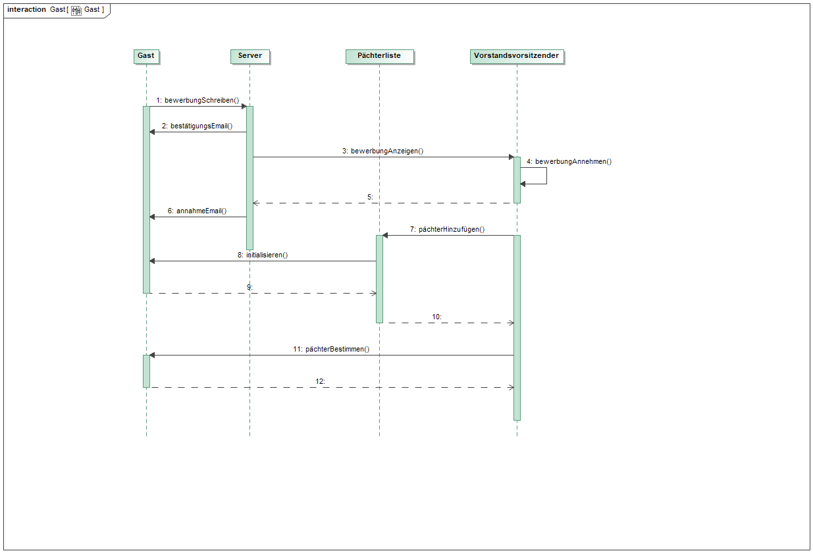
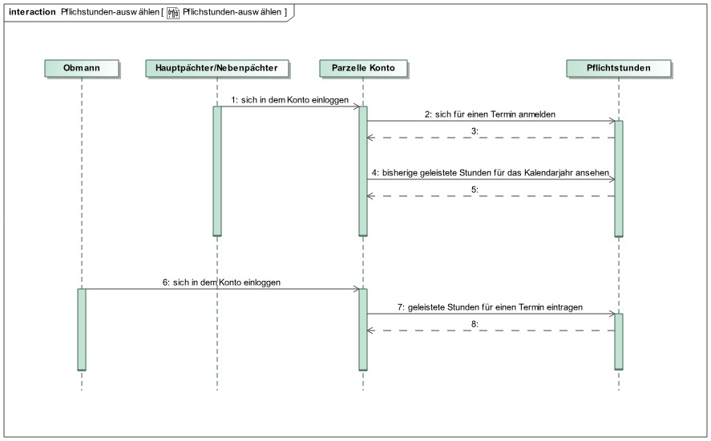
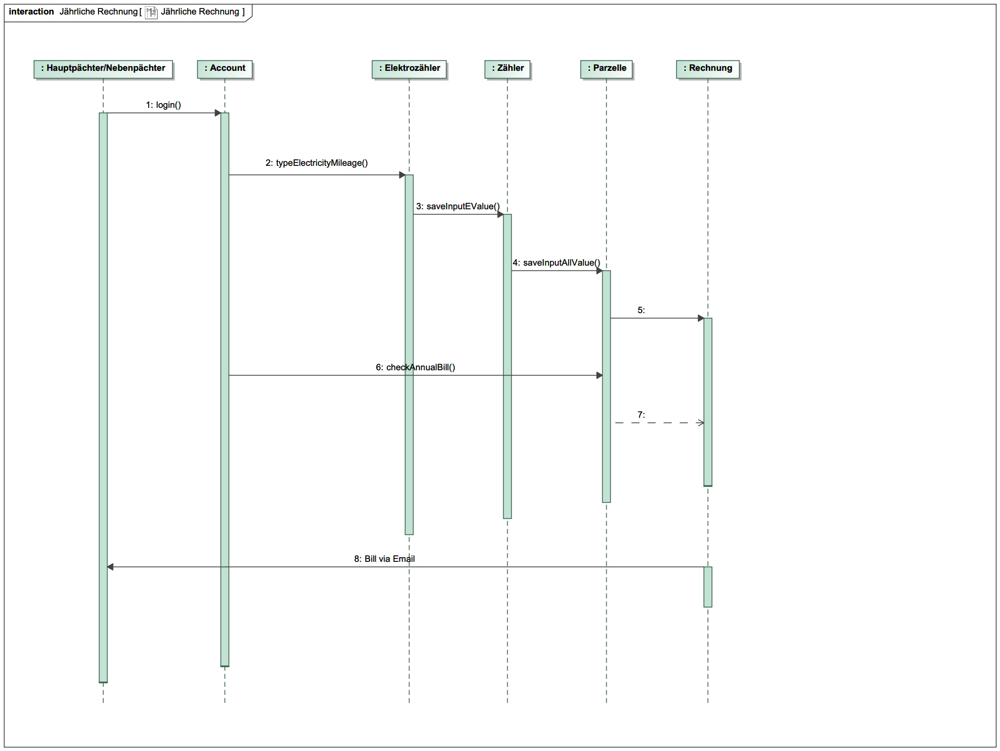

// -- Table of Contents

:toc:
:toclevels: 3
:toc-title: Inhaltsverzeichnis
:toc-placement!:
:sectanchors:
:numbered:

= Pflichtenheft  __{project_name}__
:project_name: Kleingartenanlage
==

[options="header"]
[cols="1, 1, 1, 1, 4"]
|===
|Version | Status      | Bearbeitungsdatum   | Autoren(en) |  Vermerk
|0.1     | In Arbeit   | 10.10.2019          | Autor       | Initiale Version

|0.1.1
| ...
| 28.10.2019
| Albert Wellerdt
| Vorarbeit Interessengruppen, Produktnutzung, Akteure, Anwendungsfallbeschreibung Pflichtstunden,
 Muss-Kriterien und Kann-Kriterien

|0.1.2
| ...
| 28.10.2019
| Franziska Kiel
| Zusammenfassung, Aufgabenstellung und Zielsetzung, Sequenzdiagramm Parzellenbewerbung

|0.2
| ...
| 29.10.2019
| Isabell Zorr
| Überarbeitung Versionsverzeichnis, Inhaltsverzeichnis

|0.2.1
| ...
| 30.10.2019
| Muhammad Talal Anwar
| Überarbeitung von dem Pflichstunden Anwendungsfall

| 0.3
| ...
| 30.10.2019
| Isabell Zorr
| Ergänzung Interessensgruppen und Akteure

|0.4
| ...
| 31.10.2019
| Sanghyun Lee
| Überarbeitung von jährlichen Rechungen

|===

toc::[]

== Zusammenfassung
Im Pflichtenheft finden Sie alle Aufgabenstellungen, wichtige Modelle und sowie den GUI Entwurf der Kleingartenanlage.
Es werden die Anforderungen und die Ziele der Software hier spezifiziert.

== Aufgabenstellung und Zielsetzung

Für eine Kleingartenanlage ist ein automatisiertes Verwaltungssystem für verschiedene Personengruppen zu erstellen.

Genutzt werden soll das Programm grundsätzlich von fünf Personengruppen. Das sind der Vorstand
selbst, dann die Pächter, Obmänner, die Vereinsgaststätte und zu guter Letzt noch Gäste.
Die gesamte Anlage hat insgesamt 200 Parzellen. Jede Parzelle besitzt einen Hauptpächter, es kann
aber ein Nebenpächter eingetragen werden. Darüber hinaus sollen auch die letzten beiden
Vorpächter im System gespeichert werden. Nur der Hauptpächter ist zur jährlich stattfindenden
Hauptversammlung stimmberechtigt. Jeder Pächter ist mit vollständiger Adresse, seinen
Kontaktdaten, sowie seinem bzw. ihrem Geburtstag im System erfasst.
Des Weiteren hat jede Parzelle eine bestimmte Größe, die zwischen 150 und 300m² liegt. Jede Parzelle hat einen
Wasseranschluss und einen Elektroanschluss, an denen jeweils ein Zähler installiert ist. Jeder Pächter
erhält einmal im Jahr eine Rechnung, die sich wie folgt zusammensetzt. Die Kosten für ein Jahr
errechnen sich aus variablen Preisen der Miete für die Pacht, Wasser- und Stromkosten, Mitglieds-, Haft- und Sozialbeitrag,
Rechtsschutz, Winterdienst, Aufwandspauschale und sonstigen Auslagen.
Die Pächter werden dazu im
Herbst darüber informiert, dass sie in den nächsten 2 Wochen die Zählerstände für Wasser und
Strom abzulesen und einzutragen haben. Werden keine Werte bis dahin eingetragen, soll ein
geschätzter Wert eingetragen werden. Die entstandene Rechnung soll dem Pächter unter seinem
Account zugänglich sein, eine zusätzliche Information per E‐Mail wäre aber sinnvoll. Der Vorstand soll
nach der Frist Informationen über den Gesamtverbrauch an Wasser in der Anlage erhalten, um dies
mit dem Hauptwasserzähler vergleichen zu können.

Der Vorstand selber setzt sich zusammen aus einem Vorstandsvorsitzenden, seinem Stellvertreter,
einem Protokollanten, einem für die Finanzen verantwortlichen Schatzmeister, sowie den
Obmännern. Von diesen Obmännern gibt es insgesamt acht, die sich jeweils um die Belange von 25
Gärten kümmern. Obmänner dienen dabei als eine Art Zwischenglied zwischen dem einzelnen
Pächter und dem Vorstandsvorsitz. Sie können z.B. bei kleinen Konflikten zwischen Pächtern
vermitteln, ohne sofort die höchste Instanz zu behelligen. Sie können ebenfalls eine erste Ermahnung
aussprechen, wenn ein Pächter gegen die Vereinsstatuten verstößt, indem er z.B. eine zu große
Fläche fest überdacht, dem Garten zu wenig Pflege oder der Dreiteilung (1/3 bebaut, 1/3 begrünt,
1/3 angebaut) offensichtlich widersprochen hat. Sollte der Mangel innerhalb einer vom Obmann
festgelegten Zeitspanne nicht behoben sein, wird sich der Vorstand der Sache annehmen und bei
wiederholter Uneinsicht des Pächters eine zweite Ermahnung und zu guter Letzt eine Kündigung
aussprechen. Nach der Kündigung, egal ob vom Vorstand ausgesprochen oder von selbst eingereicht,
wird die Parzelle wieder als frei angezeigt. Von da an muss der Vorpächter allerdings warten, bis sich
ein neuer Pächter findet, um evtl. materielle Werte ersetzt zu bekommen.

Jede Parzelle soll einen eigenen Login bekommen. Nach dem Anmelden sollen dem Pächter alle
wichtigen Informationen übersichtlich angezeigt werden. Es soll weiterhin möglich sein, Anträge an
den Vorstand zu stellen, bspw. Bauanträge für einen Neu‐, Um‐ oder Ausbau der Laube. Von jeder
Parzelle wird erwartet, dass sie pro Kalenderjahr vier Pflichtstunden zur Erhaltung, Pflege und
Instandhaltung der Gemeinschaftsanlagen leistet. Um ein Organisationschaos zu vermeiden, werden
vom Vorstand bis spätestens 31.03. jeden Jahres acht Termine zur Ableistung der Stunden
festgesetzt. Diese finden nur im April, Mai, Juni und September entweder an einem Freitag von 16 bis
20 Uhr oder an einem Samstag zwischen 8 und 12 Uhr statt. Pächter können sich für diese Termine
bis spätestens zwei Wochen vorher mit der von ihnen gewünschten Anzahl zu leistender Stunden
anmelden. Zu jedem Termin ist ebenfalls ein aufsichtsführender Obmann anwesend, der die zu
erledigenden Aufgaben an die Pächter verteilt und im Anschluss die geleisteten Stunden bestätigt
bzw. die tatsächlich geleisteten Stunden einträgt. Die Obmänner müssen daher nach erfolgreicher
Festlegung der Termine über diese informiert werden, damit sie sich für einen Termin eintragen
können. Da der Vorstand und die Obmänner über das Jahr verteilt mit genug Aufgaben beschäftigt
sind, müssen sie keine Pflichtstunden leisten. Werden bis zum letztmöglichen Termin nicht alle
Pflichtstunden abgeleistet, werden pro Stunde 8 Euro zur jährlichen Rechnung eines Pächters
hinzugefügt. Dabei wird auf halbe Stunden abgerundet.

Gäste benötigen keinen Login und haben nur rudimentären Zugriff auf das System. Sie können sich
Infos über geplante Veranstaltungen und Feste, wie z.B. das jährlich stattfindende Hexenbrennen
oder Gartenfest ansehen. Sie können sich ebenso eine Übersicht der freien Parzellen ansehen und
sich über ein Formular für eine oder mehrere Parzellen bewerben. Dabei sind der Name des
Interessenten sowie eine Telefonnummer und eine gültige E‐Mail‐Adresse verpflichtend anzugeben.
Freie Parzellen sind gekennzeichnet durch eine Quadratmeteranzahl, eine kurze Auflistung der auf
oder in der Parzelle befindlichen Bebauungen (wie bspw. Laube, Teich, Grill, ...) und Gehölzen, sowie
durch unabhängige Wertermittler berechneten Schätzwert, der als Ablösesumme auf
Verhandlungsbasis für den Vorpächter zu verstehen ist. Der Vorstand erhält dann bei erneuter
Anmeldung am System einen Hinweis, dass es neue Bewerber für eine oder mehrere Parzellen gibt.
Es soll neue Bewerbungen, bearbeitete Bewerbungen, angenommene Bewerbungen und gelöschte
Bewerbungen geben. So kann sich der Vorstand telefonisch mit dem oder den Bewerbern in
Verbindung setzen, um bspw. einen Besichtigungstermin auszumachen. Die Anfragen sollen so lange
bestehen bleiben, bis der Vorstand sich für einen Bewerber entschieden hat. Danach sollen alle
Bewerbungen für eine Parzelle gelöscht werden. Der Vorstand kann jedoch auch vorher eine
Bewerbung schon aus anderen Gründen löschen. Sollte der Vorstand einen passenden Bewerber für
eine Parzelle gefunden haben und Vorpächter und neuer Pächter sich mit der Ablösesumme
einverstanden erklären, wird die entsprechende Bewerbung als angenommen deklariert und alle
anderen gelöscht. Dabei könnten die bereits gemachten persönlichen Daten des neuen Pächters in
das Änderungsformular der entsprechenden Parzelle übernommen werden. Optional wäre es
sinnvoll, wenn alle abgelehnten Bewerber über eine E‐Mail darüber informiert werden, dass die
Parzelle vergeben wurde. Gäste können sich weiterhin aktuelle Termine und Veranstalltungen anschauen.

Ziele der Webapplikation:

- Werbeplattform der Kleingartenanlage nach außen
- Verwaltungssystem für:
* Vorstand
* Pächter
* Gäste
* Parzellen
* anfallende Formulare und Arbeiten
- Repräsentation der Kleingartenanlage durch ein ansprechendes und intuitives Design im Web

== Produktnutzung
Das System wird hauptsächlich für die Verwaltung einer Kleingartenlage genutzt.
Zusätzlich repräsentiert die Software die Anlage auch im Web.

Dabei wird das System auf den Geräten in der Kleingartenanlage laufen und im Internet(über den Browser) für die Pächter.
Das System wird dabei für die neuesten Versionen folgender Browser optimiert, worüber es erreichbar ist:

- Google Chrome
- Mozilla Firefox

Die Nutzer, die das System am häufigsten nutzen werden, sind alle Leute, die sich über die aktuellen News der Kleingartenanlage informieren wollen und
welche die sich für eine Parzelle bewerben wollen. Dabei wird nur typische Website Navigation vorausgesetzt.

Der Vorstand muss mit dem Umgang mit dem System vertraut gemacht werden, um sie effektiv nutzen zu können.
Spezielle Vorkenntnisse sind hier aber auch nicht erforderlich.

Alle Daten werden persistent in einer Datenbank gespeichert, wobei kein SQL Wissen vom Manager nötig ist.

== Interessensgruppen (Stakeholders)
Hier ist jede Gruppe gelistet, die irgendeinen Einfluss auf das Projekt hat.
Die Priorität 1-5 (niedrig-hoch) soll bei sich überschneidenden Zielen eine Entscheidungshilfe bieten.

[options="header"]
[cols="1,2,3,4"]
|===
|Name  |Priorität  |Beschreibung  |Ziele
|Pächter |5  |Dem Pächter soll es ermöglicht werden, sämtliche Anliegen rund um seinen Kleingarten zu koordinieren.
| - Einsicht in seine Rechnungen +

- Terminplanung

|Gast |1 | Dem Gast soll eine ansprechende Übersicht über die Kleingartenanlage ermöglicht werden und
bei belieben die Bewerbung auf eine freie Parzelle in dieser.
|- Einsicht in die anstehenden Veranstaltungen im Reiter "News"

- Bewerbung auf eine Parzelle im Reiter "Parzellen"

- Login als Pächter

|===

== Systemgrenze und Top-Level-Architektur

=== Kontextdiagramm
Das Kontextdiagramm zeigt das geplante Software-System in seiner Umgebung. Zur Umgebung gehören alle Nutzergruppen des Systems und Nachbarsysteme. Die Grafik kann auch informell gehalten sein. Überlegen Sie sich dann geeignete Symbole. Die Grafik kann beispielsweise mit Visio erstellt werden. Wenn nötig, erläutern Sie diese Grafik.

=== Top-Level-Architektur
Dokumentieren Sie ihre Top-Level-Architektur mit Hilfe eines Komponentendiagramm.

== Anwendungsfälle

=== Akteure

Akteure sind die Benutzer des Software-Systems oder Nachbarsysteme, welche darauf zugreifen. Dokumentieren Sie die Akteure in einer Tabelle. Diese Tabelle gibt einen Überblick über die Akteure und beschreibt sie kurz. Die Tabelle hat also mindestens zwei Spalten (Akteur Name und Kommentar).
Weitere relevante Spalten können bei Bedarf ergänzt werden.

// See http://asciidoctor.org/docs/user-manual/#tables
[options="header"]
[cols="1,4"]
|===
|Name |Beschreibung
|Vorstandsvorsitz  | Koordination der Belange der Kleingartenanlage, wie einen neuen Parzellen-Login anlegen, Parzellen
als frei deklarieren, Termine im Reiter "News" sowohl für Veranstaltungen als auf für Pflichtstunden setzen, Rechnungen
einsehen, Pächter kündigen, Bewerbungen bearbeiten +
|Schatzmeister | Schreiben der Rechnungen, Änderung der Preise +
|Obmann |  +
|Protokollant | Protokolliert Treffen des Vorstandes +
|Hauptpächter | Hauptansprechpartner für den Kleingarten +
|Nebenpächter | Vom Hauptpächter und Vorstand genehmigter Mitbenutzer der Parzelle +
| Gast | unangemeldeter Nutzer
|===

=== Überblick Anwendungsfalldiagramm
Anwendungsfall-Diagramm, das alle Anwendungsfälle und alle Akteure darstellt

=== Anwendungsfallbeschreibungen
Dieser Unterabschnitt beschreibt die Anwendungsfälle. In dieser Beschreibung müssen noch nicht alle Sonderfälle und Varianten berücksichtigt werden. Schwerpunkt ist es, die wichtigsten Anwendungsfälle des Systems zu finden. Wichtig sind solche Anwendungsfälle, die für den Auftraggeber, den Nutzer den größten Nutzen bringen.
Für komplexere Anwendungsfälle ein UML-Sequenzdiagramm ergänzen.
Einfache Anwendungsfälle mit einem Absatz beschreiben.
Die typischen Anwendungsfälle (Anlegen, Ändern, Löschen) können zu einem einzigen zusammengefasst werden.

[options="header"]
[cols="^1h,3"]
|===

|ID
|UC0010
|Name
|Bewerbungsvorgang um eine Parzelle und Hinzufügen eines neuen Pächters

|Beschreibung
|Der Gast bewirbt sich über ein Formular auf eine Parzelle, welche vom Vorstand gesichtet und angenommen wird.
Daraufhin erstellt der Vorstand einen neuen Pächteraccount.

|Akteure
|Vorstandsvorsitz, Gast

|Auslöser
|Gast füllt des Bewerbungsformular aus

|Vorbedingungen
|Gast ist nicht angemeldet und Parzelle ist frei

|Wichtigste Schritte
|1. Gast füllt Formular aus +
2. Vorstandsvorsitzender nimmt Bewerbung an

|Erweitert
|nur der Vorstand kann einen Account hinzufügen

|Funktionale Anforderung
|?
|===

[options="header"]
[cols="^1h,3"]
|===

|ID
|UC0020
|Name
|Pflichtstunden Termin auswählen und dafür die Stunden eintragen

|Beschreibung
|Der Haupt-/Nebenpächter wählt einen Termin zur Leistung der Pflichstunden für eine Parzelle aus. Diese Stunden sind von dem aufsichtsführenden Obmann bestätigt und im Anschluss im betreffenden Parzelle Konto eingetragen.

|Akteure
|Hauptpächter, Nebenpächter, Obmann

|Auslöser
|Der Haupt-/Nebenpächter wählt einen Termin für die Pflichtstunden Leistung aus.

|Vorbedingungen
|Der Benutzer ist eingeloggt.

|Wichtigste Schritte
|1. Der Haupt-/Nebenpächter meldet sich für einen Termin an +
2. Der betreffende Obmann trägt die geleistete Studen ein

|Erweitert
|Nur der Obmann kann die Stunden eintragen und nur wenn der Haupt-/Nebenpächter seine Aufgabe erledigt hat.

|Funktionale Anforderung
|""

|===

Image 3

[options="header"]
[cols="^1h,3"]
|===

|ID
|UC0030
|Name
|Parzellen Bewerbung

|Beschreibung
|""

|Akteure
|Vorstandsvorsitzende, Stellvertreter, Gast

|Auslöser
|""

|Vorbedingungen
|""

|Wichtigste Schritte
|1. "" +
2. "" +
3. "" +
4. "" +
5. ""

|Erweitert
|""

|Funktionale Anforderung
|""

|===

[options="header"]
[cols="^1h,3"]
|===

|ID
|UC0040
|Name
|Jährliche Rechnung

|Beschreibung
|Haupt-/Nebenpächter eingibt Verbrauch der Elektrizität und bekommt eine jährliche Rechnung per Email

|Akteure
|Hauptpächter, Nebenpächter

|Auslöser
|Der Haupt-/Nebenpächter eingibt Verbrauch der Elektrizität in seinem Account.

|Vorbedingungen
|Der Benutzer ist eingeloggt.

|Wichtigste Schritte
|1. Der Haupt-/Nebenpächter eingibt Verbrauch der Elektrizität in seinem Account +
2. Der Haupt-/Nebenpächter kann seine Rechung in seiner Parzelle-Webseite finden. +
3. Durch Klicken der Rechnung-Taste bekommt man eine jährliche Rechnung per Email.

|Erweitert
|""

|Funktionale Anforderung
|""

|===

[options="header"]
[cols="^1h,3"]

== Funktionale Anforderungen

=== Muss-Kriterien
Was das zu erstellende Programm auf alle Fälle leisten muss. +

- Liste aller Mitglieder +
- Liste aller Parzellen (frei und besetzt) +

Parzellenmanagment +
- Zähler (Wasser + Elektro) +
- Pflichtstunden +

Accoutmanagement +
- Accounts löschen und hinzufügen +
- Rechnungs einsehen +

Finanzmanagement +
- Rechnung generieren +
- Liste an Basispreisen +
- Werteermittlung +

Anträge +
- Bauanträge +
- Bewerbungen (Liste) +

=== Kann-Kriterien
Anforderungen die das Programm leisten können soll, aber für den korrekten Betrieb entbehrlich sind. +
- (Accounts bearbeiten) ?

== Nicht-Funktionale Anforderungen

=== Qualitätsziele

Dokumentieren Sie in einer Tabelle die Qualitätsziele, welche das System erreichen soll, sowie deren Priorität.

=== Konkrete Nicht-Funktionale Anforderungen

Beschreiben Sie Nicht-Funktionale Anforderungen, welche dazu dienen, die zuvor definierten Qualitätsziele zu erreichen.
Achten Sie darauf, dass deren Erfüllung (mindestens theoretisch) messbar sein muss.

== GUI Prototyp

In diesem Kapitel soll ein Entwurf der Navigationsmöglichkeiten und Dialoge des Systems erstellt werden.
Idealerweise entsteht auch ein grafischer Prototyp, welcher dem Kunden zeigt, wie sein System visuell umgesetzt werden soll.
Konkrete Absprachen - beispielsweise ob der grafische Prototyp oder die Dialoglandkarte höhere Priorität hat - sind mit dem Kunden zu treffen.

=== Überblick: Dialoglandkarte
Erstellen Sie ein Übersichtsdiagramm, das das Zusammenspiel Ihrer Masken zur Laufzeit darstellt. Also mit welchen Aktionen zwischen den Masken navigiert wird.
//Die nachfolgende Abbildung zeigt eine an die Pinnwand gezeichnete Dialoglandkarte. Ihre Karte sollte zusätzlich die Buttons/Funktionen darstellen, mit deren Hilfe Sie zwischen den Masken navigieren.

=== Dialogbeschreibung
Für jeden Dialog:

1. Kurze textuelle Dialogbeschreibung eingefügt: Was soll der jeweilige Dialog? Was kann man damit tun? Überblick?
2. Maskenentwürfe (Screenshot, Mockup)
3. Maskenelemente (Ein/Ausgabefelder, Aktionen wie Buttons, Listen, …)
4. Evtl. Maskendetails, spezielle Widgets

== Datenmodell

=== Überblick: Klassendiagramm
UML-Analyseklassendiagramm

=== Klassen und Enumerationen
Dieser Abschnitt stellt eine Vereinigung von Glossar und der Beschreibung von Klassen/Enumerationen dar. Jede Klasse und Enumeration wird in Form eines Glossars textuell beschrieben. Zusätzlich werden eventuellen Konsistenz- und Formatierungsregeln aufgeführt.

// See http://asciidoctor.org/docs/user-manual/#tables
[options="header"]
|===
|Klasse/Enumeration |Beschreibung |
|…                  |…            |
|===

== Akzeptanztestfälle
Mithilfe von Akzeptanztests wird geprüft, ob die Software die funktionalen Erwartungen und Anforderungen im Gebrauch erfüllt. Diese sollen und können aus den Anwendungsfallbeschreibungen und den UML-Sequenzdiagrammen abgeleitet werden. D.h., pro (komplexen) Anwendungsfall gibt es typischerweise mindestens ein Sequenzdiagramm (welches ein Szenarium beschreibt). Für jedes Szenarium sollte es einen Akzeptanztestfall geben. Listen Sie alle Akzeptanztestfälle in tabellarischer Form auf.
Jeder Testfall soll mit einer ID versehen werde, um später zwischen den Dokumenten (z.B. im Test-Plan) referenzieren zu können.

== Glossar
Sämtliche Begriffe, die innerhalb des Projektes verwendet werden und deren gemeinsames Verständnis aller beteiligten Stakeholder essentiell ist, sollten hier aufgeführt werden.
Insbesondere Begriffe der zu implementierenden Domäne wurden bereits beschrieben, jedoch gibt es meist mehr Begriffe, die einer Beschreibung bedürfen. +
Beispiel: Was bedeutet "Kunde"? Ein Nutzer des Systems? Der Kunde des Projektes (Auftraggeber)?

== Offene Punkte
Offene Punkte werden entweder direkt in der Spezifikation notiert. Wenn das Pflichtenheft zum finalen Review vorgelegt wird, sollte es keine offenen Punkte mehr geben.
