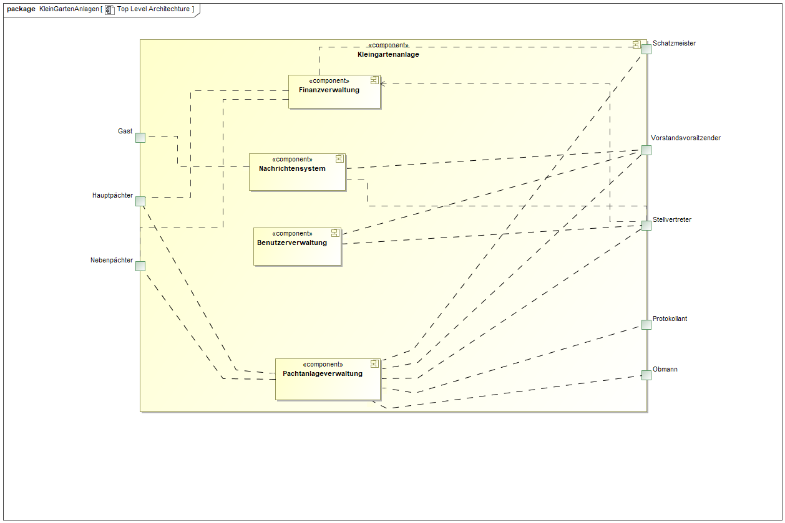
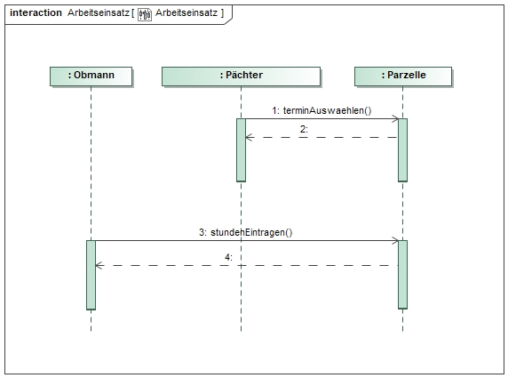
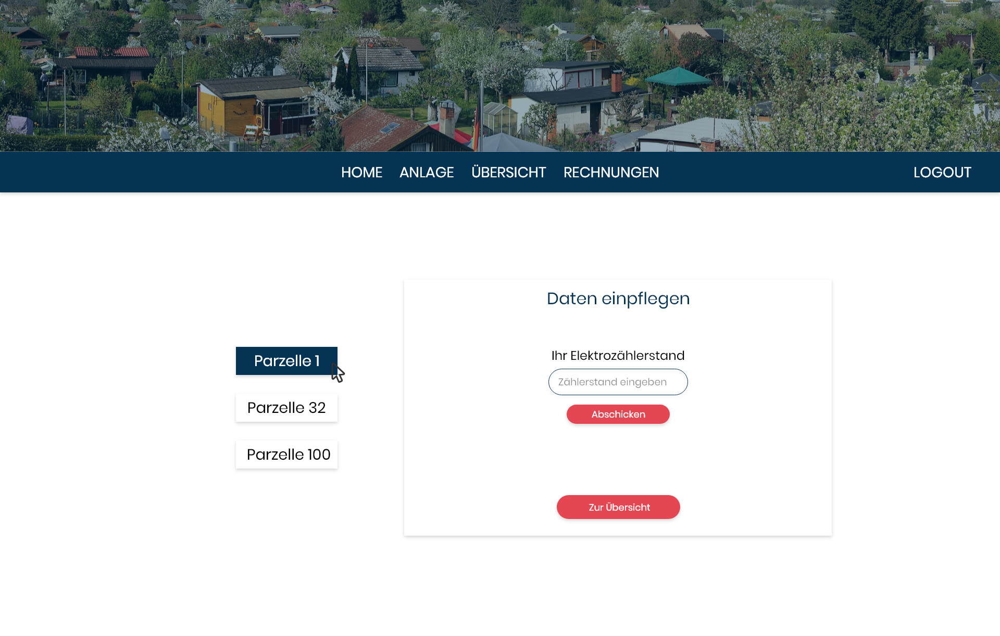
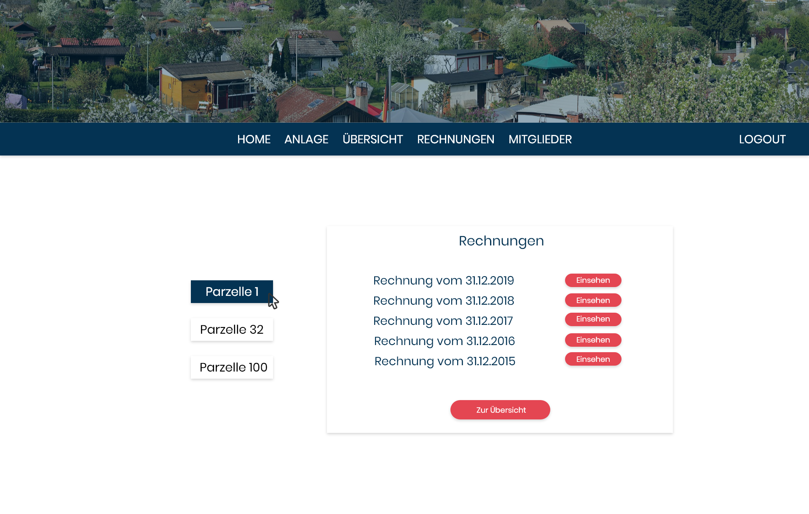
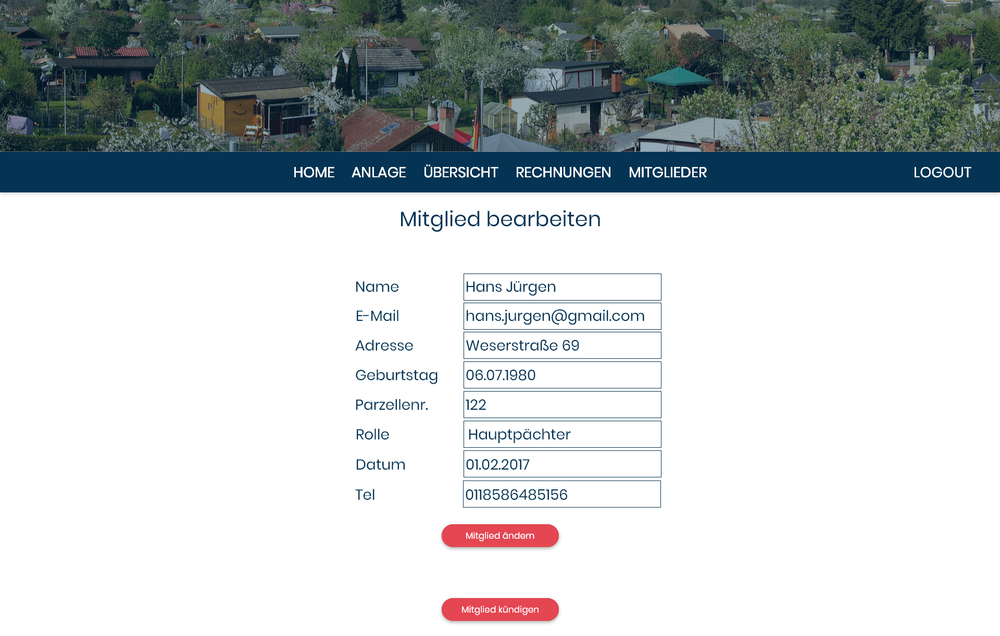

// -- Table of Contents

:toc:
:toclevels: 3
:toc-title: Inhaltsverzeichnis
:toc-placement!:
:sectanchors:
:numbered:

= Pflichtenheft  __{project_name}__
:project_name: Kleingartenanlage

[options="header"]
[cols="1, 1, 1, 1, 4"]
|===
|Version | Status      | Bearbeitungsdatum   | Autoren(en) |  Vermerk
|0.1     | In Arbeit   | 10.10.2019          | Autor       | Initiale Version

|0.1.1
| ...
| 28.10.2019
| Albert Wellerdt
| Vorarbeit Interessengruppen, Produktnutzung, Akteure, Anwendungsfallbeschreibung Pflichtstunden,
 Muss-Kriterien und Kann-Kriterien

|0.1.2
| ...
| 28.10.2019
| Franziska Kiel
| Zusammenfassung, Aufgabenstellung und Zielsetzung, Sequenzdiagramm Parzellenbewerbung

|0.2
| ...
| 29.10.2019
| Isabell Zorr
| Überarbeitung Versionsverzeichnis, Inhaltsverzeichnis

|0.2.1
| ...
| 30.10.2019
| Muhammad Talal Anwar
| Überarbeitung von dem Pflichstunden Anwendungsfall

| 0.3
| ...
| 30.10.2019
| Isabell Zorr
| Ergänzung Interessensgruppen und Akteure

|0.4
| ...
| 31.10.2019
| Sanghyun Lee
| Überarbeitung von jährlichen Rechungen

|0.4.1
| ...
| 31.10.2019
| Muhammad Talal Anwar
| Überarbeitung von Arbeitseinsatz Anwendungsfall

|0.5
| ...
| 31.10.2019
| Muhammad Talal Anwar
| Akzeptanztestfälle

|===

toc::[]

== Zusammenfassung
Im Pflichtenheft finden Sie alle Aufgabenstellungen, wichtige Modelle und sowie den GUI Entwurf der Kleingartenanlage.
Es werden die Anforderungen und die Ziele der Software hier spezifiziert.

== Aufgabenstellung und Zielsetzung

Für eine Kleingartenanlage ist ein automatisiertes Verwaltungssystem für verschiedene Personengruppen zu erstellen.

Genutzt werden soll das Programm grundsätzlich von fünf Personengruppen. Das sind der Vorstand
selbst, dann die Pächter, Obmänner, die Vereinsgaststätte und zu guter Letzt noch Gäste.
Die gesamte Anlage hat insgesamt 200 Parzellen. Jede Parzelle besitzt einen Hauptpächter, es kann
aber ein Nebenpächter eingetragen werden. Darüber hinaus sollen auch die letzten beiden
Vorpächter im System gespeichert werden. Nur der Hauptpächter ist zur jährlich stattfindenden
Hauptversammlung stimmberechtigt. Jeder Pächter ist mit vollständiger Adresse, seinen
Kontaktdaten, sowie seinem bzw. ihrem Geburtstag im System erfasst.
Des Weiteren hat jede Parzelle eine bestimmte Größe, die zwischen 150 und 300m² liegt. Jede Parzelle hat einen
Wasseranschluss und einen Elektroanschluss, an denen jeweils ein Zähler installiert ist. Jeder Pächter
erhält einmal im Jahr eine Rechnung, die sich wie folgt zusammensetzt. Die Kosten für ein Jahr
errechnen sich aus variablen Preisen der Miete für die Pacht, Wasser- und Stromkosten, Mitglieds-, Haft- und Sozialbeitrag,
Rechtsschutz, Winterdienst, Aufwandspauschale und sonstigen Auslagen.
Die Pächter werden dazu im
Herbst darüber informiert, dass sie in den nächsten 2 Wochen die Zählerstände für Wasser und
Strom abzulesen und einzutragen haben. Werden keine Werte bis dahin eingetragen, soll ein
geschätzter Wert eingetragen werden. Die entstandene Rechnung soll dem Pächter unter seinem
Account zugänglich sein, eine zusätzliche Information per E‐Mail wäre aber sinnvoll. Der Vorstand soll
nach der Frist Informationen über den Gesamtverbrauch an Wasser in der Anlage erhalten, um dies
mit dem Hauptwasserzähler vergleichen zu können.

Der Vorstand selber setzt sich zusammen aus einem Vorstandsvorsitzenden, seinem Stellvertreter,
einem Protokollanten, einem für die Finanzen verantwortlichen Schatzmeister, sowie den
Obmännern. Von diesen Obmännern gibt es insgesamt acht, die sich jeweils um die Belange von 25
Gärten kümmern. Obmänner dienen dabei als eine Art Zwischenglied zwischen dem einzelnen
Pächter und dem Vorstandsvorsitz. Sie können z.B. bei kleinen Konflikten zwischen Pächtern
vermitteln, ohne sofort die höchste Instanz zu behelligen. Sie können ebenfalls eine erste Ermahnung
aussprechen, wenn ein Pächter gegen die Vereinsstatuten verstößt, indem er z.B. eine zu große
Fläche fest überdacht, dem Garten zu wenig Pflege oder der Dreiteilung (1/3 bebaut, 1/3 begrünt,
1/3 angebaut) offensichtlich widersprochen hat. Sollte der Mangel innerhalb einer vom Obmann
festgelegten Zeitspanne nicht behoben sein, wird sich der Vorstand der Sache annehmen und bei
wiederholter Uneinsicht des Pächters eine zweite Ermahnung und zu guter Letzt eine Kündigung
aussprechen. Nach der Kündigung, egal ob vom Vorstand ausgesprochen oder von selbst eingereicht,
wird die Parzelle wieder als frei angezeigt. Von da an muss der Vorpächter allerdings warten, bis sich
ein neuer Pächter findet, um evtl. materielle Werte ersetzt zu bekommen.

Jede Parzelle soll einen eigenen Login bekommen. Nach dem Anmelden sollen dem Pächter alle
wichtigen Informationen übersichtlich angezeigt werden. Es soll weiterhin möglich sein, Anträge an
den Vorstand zu stellen, bspw. Bauanträge für einen Neu‐, Um‐ oder Ausbau der Laube. Von jeder
Parzelle wird erwartet, dass sie pro Kalenderjahr vier Pflichtstunden zur Erhaltung, Pflege und
Instandhaltung der Gemeinschaftsanlagen leistet. Um ein Organisationschaos zu vermeiden, werden
vom Vorstand bis spätestens 31.03. jeden Jahres acht Termine zur Ableistung der Stunden
festgesetzt. Diese finden nur im April, Mai, Juni und September entweder an einem Freitag von 16 bis
20 Uhr oder an einem Samstag zwischen 8 und 12 Uhr statt. Pächter können sich für diese Termine
bis spätestens zwei Wochen vorher mit der von ihnen gewünschten Anzahl zu leistender Stunden
anmelden. Zu jedem Termin ist ebenfalls ein aufsichtsführender Obmann anwesend, der die zu
erledigenden Aufgaben an die Pächter verteilt und im Anschluss die geleisteten Stunden bestätigt
bzw. die tatsächlich geleisteten Stunden einträgt. Die Obmänner müssen daher nach erfolgreicher
Festlegung der Termine über diese informiert werden, damit sie sich für einen Termin eintragen
können. Da der Vorstand und die Obmänner über das Jahr verteilt mit genug Aufgaben beschäftigt
sind, müssen sie keine Pflichtstunden leisten. Werden bis zum letztmöglichen Termin nicht alle
Pflichtstunden abgeleistet, werden pro Stunde 8 Euro zur jährlichen Rechnung eines Pächters
hinzugefügt. Dabei wird auf halbe Stunden abgerundet.

Gäste benötigen keinen Login und haben nur rudimentären Zugriff auf das System. Sie können sich
Infos über geplante Veranstaltungen und Feste, wie z.B. das jährlich stattfindende Hexenbrennen
oder Gartenfest ansehen. Sie können sich ebenso eine Übersicht der freien Parzellen ansehen und
sich über ein Formular für eine oder mehrere Parzellen bewerben. Dabei sind der Name des
Interessenten sowie eine Telefonnummer und eine gültige E‐Mail‐Adresse verpflichtend anzugeben.
Freie Parzellen sind gekennzeichnet durch eine Quadratmeteranzahl, eine kurze Auflistung der auf
oder in der Parzelle befindlichen Bebauungen (wie bspw. Laube, Teich, Grill, ...) und Gehölzen, sowie
durch unabhängige Wertermittler berechneten Schätzwert, der als Ablösesumme auf
Verhandlungsbasis für den Vorpächter zu verstehen ist. Der Vorstand erhält dann bei erneuter
Anmeldung am System einen Hinweis, dass es neue Bewerber für eine oder mehrere Parzellen gibt.
Es soll neue Bewerbungen, bearbeitete Bewerbungen, angenommene Bewerbungen und gelöschte
Bewerbungen geben. So kann sich der Vorstand telefonisch mit dem oder den Bewerbern in
Verbindung setzen, um bspw. einen Besichtigungstermin auszumachen. Die Anfragen sollen so lange
bestehen bleiben, bis der Vorstand sich für einen Bewerber entschieden hat. Danach sollen alle
Bewerbungen für eine Parzelle gelöscht werden. Der Vorstand kann jedoch auch vorher eine
Bewerbung schon aus anderen Gründen löschen. Sollte der Vorstand einen passenden Bewerber für
eine Parzelle gefunden haben und Vorpächter und neuer Pächter sich mit der Ablösesumme
einverstanden erklären, wird die entsprechende Bewerbung als angenommen deklariert und alle
anderen gelöscht. Dabei könnten die bereits gemachten persönlichen Daten des neuen Pächters in
das Änderungsformular der entsprechenden Parzelle übernommen werden. Optional wäre es
sinnvoll, wenn alle abgelehnten Bewerber über eine E‐Mail darüber informiert werden, dass die
Parzelle vergeben wurde. Gäste können sich weiterhin aktuelle Termine und Veranstalltungen anschauen.

Ziele der Webapplikation:

- Werbeplattform der Kleingartenanlage nach außen
- Verwaltungssystem für:
* Vorstand
* Pächter
* Gäste
* Parzellen
* anfallende Formulare und Arbeiten
- Repräsentation der Kleingartenanlage durch ein ansprechendes und intuitives Design im Web

== Produktnutzung
Das System wird hauptsächlich für die Verwaltung einer Kleingartenlage genutzt.
Zusätzlich repräsentiert die Software die Anlage auch im Web.

Dabei wird das System auf den Geräten in der Kleingartenanlage laufen und im Internet(über den Browser) für die Pächter.
Das System wird dabei für die neuesten Versionen folgender Browser optimiert, worüber es erreichbar ist:

- Google Chrome
- Mozilla Firefox

Die Nutzer, die das System am häufigsten nutzen werden, sind alle Leute, die sich über die aktuellen News der Kleingartenanlage informieren wollen und
welche die sich für eine Parzelle bewerben wollen. Dabei wird nur typische Website Navigation vorausgesetzt.

Der Vorstand muss mit dem Umgang mit dem System vertraut gemacht werden, um sie effektiv nutzen zu können.
Spezielle Vorkenntnisse sind hier aber auch nicht erforderlich.

Alle Daten werden persistent in einer Datenbank gespeichert, wobei kein SQL Wissen vom Manager nötig ist.

== Interessensgruppen (Stakeholders)
Hier ist jede Gruppe gelistet, die irgendeinen Einfluss auf das Projekt hat.
Die Priorität 1-5 (niedrig-hoch) soll bei sich überschneidenden Zielen eine Entscheidungshilfe bieten.

[options="header"]
[cols="1,2,3,4"]
|===
|Name  |Priorität  |Beschreibung  |Ziele
|Pächter |5  |Dem Pächter soll es ermöglicht werden, sämtliche Anliegen rund um seinen Kleingarten zu koordinieren.
| - Einsicht in seine Rechnungen +
- Terminplanung

|Gast |1 | Dem Gast soll eine ansprechende Übersicht über die Kleingartenanlage ermöglicht werden und
bei belieben die Bewerbung auf eine freie Parzelle in dieser.
|- Einsicht in die anstehenden Veranstaltungen im Reiter "News" +
- Bewerbung auf eine Parzelle im Reiter "Parzellen" +
- Login als Pächter

|===

== Systemgrenze und Top-Level-Architektur

=== Kontextdiagramm
Das Kontextdiagramm zeigt das geplante Software-System in seiner Umgebung.
Zur Umgebung gehören alle Nutzergruppen des Systems und Nachbarsysteme.

=== Top-Level-Architektur

== Anwendungsfälle

=== Akteure

Akteure sind die Benutzer des Software-Systems oder Nachbarsysteme, welche darauf zugreifen. Dokumentieren Sie die Akteure in einer Tabelle. Diese Tabelle gibt einen Überblick über die Akteure und beschreibt sie kurz. Die Tabelle hat also mindestens zwei Spalten (Akteur Name und Kommentar).
Weitere relevante Spalten können bei Bedarf ergänzt werden.

// See http://asciidoctor.org/docs/user-manual/#tables
[options="header"]
[cols="1,4"]
|===
| Name             | Beschreibung
| Vorstandsvorsitz | Koordination der Belange der Kleingartenanlage, wie einen neuen Parzellen-Login anlegen, Parzellen
als frei deklarieren, Termine im Reiter "News" sowohl für Veranstaltungen als auch für Pflichtstunden setzen, Rechnungen
einsehen, Pächter kündigen, Bewerbungen bearbeiten
| Schatzmeister    | Schreiben der Rechnungen, Änderung der Preise
| Obmann           | Der Obmann kontrolliert bei den Pflichtstunden ob die Leute da sind die sich eingetragen haben und er ist die erste Instanz wenn Pächter Beschwerden abgeben.
| Protokollant     | Protokolliert Treffen des Vorstandes
| Hauptpächter     | Hauptansprechpartner für den Kleingarten
| Nebenpächter     | Vom Hauptpächter und Vorstand genehmigter Mitbenutzer der Parzelle
| Gast             | unangemeldeter Nutzer
|===

=== Überblick Anwendungsfalldiagramm

=== Anwendungsfallbeschreibungen
Dieser Unterabschnitt beschreibt die Anwendungsfälle. In dieser Beschreibung müssen noch nicht alle Sonderfälle und Varianten berücksichtigt werden. Schwerpunkt ist es, die wichtigsten Anwendungsfälle des Systems zu finden. Wichtig sind solche Anwendungsfälle, die für den Auftraggeber, den Nutzer den größten Nutzen bringen.
Für komplexere Anwendungsfälle ein UML-Sequenzdiagramm ergänzen.
Einfache Anwendungsfälle mit einem Absatz beschreiben.
Die typischen Anwendungsfälle (Anlegen, Ändern, Löschen) können zu einem einzigen zusammengefasst werden.

[cols="1h, 3"]
[[UC0010]]
|===

|ID
|**<<UC0010>>**
|Name
|Bewerbungsvorgang um eine Parzelle und Hinzufügen eines neuen Pächters

|Beschreibung
|Der Gast bewirbt sich über ein Formular auf eine Parzelle, welche vom Vorstand gesichtet und angenommen wird.
Daraufhin erstellt der Vorstand einen neuen Pächteraccount.

|Akteure
|Vorstandsvorsitz, Gast

|Auslöser
|Gast füllt des Bewerbungsformular aus

|Vorbedingungen
|Gast ist nicht angemeldet und Parzelle ist frei

|Wichtigste Schritte
|1. Gast füllt Formular aus +
2. Vorstandsvorsitzender nimmt Bewerbung an

|Erweitert
|nur der Vorstand kann einen Account hinzufügen

|Funktionale Anforderung
|?
|===

[cols="1h, 3"]
[[UC0020]]
|===

|ID
|**<<UC0020>>**
|Name
|Arbeitseinsatz

|Beschreibung
|Der Haupt-/Nebenpächter wählt einen Termin zur Leistung der Pflichstunden für eine Parzelle aus. Diese Stunden sind von dem aufsichtsführenden Obmann bestätigt und im Anschluss im betreffenden Parzelle Konto eingetragen.

|Akteure
|Hauptpächter, Nebenpächter, Obmann

|Vorbedingungen
|Der Benutzer ist eingeloggt.
|===

[cols="1h, 3"]
[[UC0030]]
|===

|ID
|**<<UC0030>>**
|Name
|Jährliche Rechnung

|Beschreibung
|Haupt-/Nebenpächter eingibt Verbrauch der Elektrizität und bekommt eine jährliche Rechnung per Email

|Akteure
|Hauptpächter, Nebenpächter

|Auslöser
|Der Haupt-/Nebenpächter eingibt Verbrauch der Elektrizität in seinem Account.

|Vorbedingungen
|Der Benutzer ist eingeloggt.

|Wichtigste Schritte
|1. Der Haupt-/Nebenpächter eingibt Verbrauch der Elektrizität in seinem Account +
2. Der Haupt-/Nebenpächter kann seine Rechung in seiner Parzelle-Webseite finden. +
3. Durch Klicken der Rechnung-Taste bekommt man eine jährliche Rechnung per Email.

|Erweitert
|""

|Funktionale Anforderung
|""

|===

== Funktionale Anforderungen

=== Muss-Kriterien

ID: 1. Buchstabe: A - Allgemein, P - Parzellenmanagement, AC - Accountmanagement,
 F - Finanzmanagement, AN - Anträge, U - Usermanagement +
2. Buchstabe: F - Funktionale Anforderung +
3. Zeichen: Fortlaufende Nummer für jeweiliges Department

*1. Allgemein*

[options="header"]
[cols="^1h,1,3"]
|===

|ID
|Name
|Beschreibung

|#A-F-01
|Funktionen von Listen mit Daten: +
- Liste aller Mitglieder +
- Liste aller freien und besetzten Parzellen +
|Listen sollen sortiert werden können, man kann nach bestimmten Einträgen suchen,
sowie neue hinzufügen

|===

*2. Parzellenmanagment*

[options="header"]
[cols="^1h,1,3"]
|===

|ID
|Name
|Beschreibung

|#P-F-01
|Wasser- und Elektrozähler

|Zählerstände können in dem Useraccount eingetragen werden und gespeichert werden

|#P-F-02
|Pflichtstunden
|User können sich in die Pflichtstunden eintragen und die geleistete Zeit wird pro Parzelle in den Parzellen gespeichert,
 Überstunden werden gespeichert und in der Parzelle gutgeschrieben für die nächsten Pflichtstunden

|===

*3. Accountmanagement*
[options="header"]
[cols="^1h,1,3"]
|===

|ID
|Name
|Beschreibung

|#AC-F-01
|Löschen und Hinzufügen
|Accounts können vom Vorstandvorsitzendem hinzugefügt werden und auch wieder gelöscht werden (Daten der User bleiben jedoch
in der Datenbank erhalten, nur der Zugang wird für gelöschte Accounts gesperrt) +

|#AC-F-02
|Rechnungen einsehen
|User können ihre Rechnungen in ihrem Account einsehen, die dort gespeichert sind

|===

*4. Finanzmanagement*

[options="header"]
[cols="^1h,1,3"]
|===

|ID
|Name
|Beschreibung

|#F-F-01
|Rechnungen generieren
|Rechnungen werden nach Eingabe der Daten vom Kassierer automatisch erstellt und in dem Useraccount gespeichert

|#F-F-02
|Liste an Basispreisen
|Es werden Basispreise erstellt, die jederzeit vom Kassierer geändert werden können

|===

*5. Anträge*

[options="header"]
[cols="^1h,1,3"]
|===

|ID
|Name
|Beschreibung

|#AN-F-01
|Bewerbungen
|Bewerbungen können vom User durch eine Vorlage ausgefüllt werden und abgeschickt werden,
die Bewerber bekommen dann eine generierte Email zugeschickt, die den Eingang der Bewerbung bestätigt,

|#AN-F-02
| Bewerbungen bearbeiten
| Bewerbungen gehen an den Vorstandsvorsitzendem ein, welche in Listen gespeichert werden,
der Vorstandsvorsitzende kann diese dann bearbeiten, er kann sie annehmen, löschen und ablehnen

|===
*6. User-Management*

[options="header"]
[cols="^1h,1,3"]
|===
|ID
|Name
|Beschreibung

|#U-F-01
|Login
|User müssen sich mit ihrer Emailadresse und einem Passwort einloggen können

|#U-F-04
|User bearbeiten
|Der Vorstandvorsitzende muss User bearbeiten können, Rollen wie Kassierer, Wassermänner, Obmänner können vom Vorstandsvorsitzendem im Pächteraccount zugeteilt werden,
die Rolle Vorstandsvorsitzender gibt es nur einmal, daher wird diese bei Neuvergabe automatisch beim Vorgänger rausgenommen

|===

=== Kann-Kriterien
[options="header"]
[cols="^1h,1,3"]
|===
|ID
|Name
|Beschreibung

|#F101
|Nachbarschaftssystem
|User können bei der Parzellenansicht ihren Nachbarn Bewertungen abgeben, die dann von jedem gesehen werden können
|===

== Nicht-Funktionale Anforderungen

=== Qualitätsziele
[options="header"]
[cols="2h,^1,^1,^1,^1,^1"]
|===
|Qualitätsziel
|1
|2
|3
|4
|5

|Anpassbarkeit (Scalability)
|X
|
|
|
|

|Wartbarkeit (Maintainability)
|
|
|X
|
|

|Erweiterbarkeit (Extensibility)
|
|
|
|
|X

|Benutzbarkeit (Usability)
|
|
|X
|
|

|Zuverlässigkeit (Reliability)
|
|
|
|X
|

|Geschwindigkeit (Performance)
|
|
|
|X
|

|Sicherheit (Security)
|
|
|
|
|X

|===

=== Konkrete Nicht-Funktionale Anforderungen
[options="header"]
[cols="1,2"]
|===
|Name
|Beschreibung

|Verfügbarkeit
|Das System sollte möglichst immer verfügbar sein, damit alle Verwaltungsangelegenheiten geklärt werden können und das
der Gast oder der Pächter die Website online sehen kann. Dabei sollte das System mindestens 99% der Zeit verfügbar sein.

|Sicherheit
|Die Passwörter der Pächter (vor allem vom Vorstand) sollten gesichert sein (nur in Hash Werte).

|Geschwindigkeit
|Das System sollte möglichst schnell sein, damit die vielen Nutzer in annehmbarer Zeit die Seite nutzen können
und keine lange Wartezeiten auftreten.
|===

== GUI Prototyp
image::models/design/GUI/Home.png[]

image::models/design/GUI/Übersicht.png[]
image::models/design/GUI/Übersicht Vorstand.png[]

image::models/design/GUI/Rechnungen Pächter.png[]

image::models/design/GUI/Mitglied hinzufügen.png[]
image::models/design/GUI/Konflikte aufgeben - Pächter.png[]
image::models/design/GUI/Konflikte einsehen - Pächter.png[]

=== Überblick: Dialoglandkarte
Erstellen Sie ein Übersichtsdiagramm, das das Zusammenspiel Ihrer Masken zur Laufzeit darstellt. Also mit welchen Aktionen zwischen den Masken navigiert wird.
//Die nachfolgende Abbildung zeigt eine an die Pinnwand gezeichnete Dialoglandkarte. Ihre Karte sollte zusätzlich die Buttons/Funktionen darstellen, mit deren Hilfe Sie zwischen den Masken navigieren.

=== Dialogbeschreibung

[options="header"]
[cols="^1h,2,3"]
|===
|Figure |Name  |Beschreibung
|1 | Startseite des {project_name} | Hier werden dem unangemeldeten Nutzer Neuigkeiten zur {project_name} angezeigt.
Mithilfe der Navigationsleiste erreicht der Nutzer den Login für die Pächter, die Anzeige der Anlage in der die verpachteten und freien Parzellen angezeigt werden.
| 2 | Anlagenanzeige | Der unangemeldete Nutzer (Gast) erhält eine Überischt über die Parzellen mit kurzer Beschreibung dieser und einer Anzeige welche Parzellen frei sind. Auf freie Parzellen kann sich der Gast mit einem Formular bewerben.
| 3 | Login | Hier können sich alle Pächter mit ihren Daten (Email-Adresse und Passwort) anmelden und gelangen so in die Ansicht für angemeldete nutzer. Ist der Login erfolglos, wird er auf die Loginseite zurückgeleitet.
| 4 | Startseite für Pächter | Der Pächter befindet sich nun auf der Newsseite, wo ihm Anlagenrelevante Veranstaltungen und die Termine zu den Pflichtstunden angezeigt werden.
Mit der Navigationsleiste kann er auf die Überischt seiner Parzelle, der Anlage, seiner abgeschickten Beschwerden und seine Rechnungen zugreifen.
| 5 | Startseite für den Vorstandsvorsitzenden | Hier sieht der Vorstandsvorsitzende die gleiche Übersicht wie ein normaler Pächter. Zusätzlich hat er die Reiter Bewerbungen, Mitglieder und Termine bearbeiten.
| 6 | Mitgliederübersicht | Die Mitgliedrübersicht gibt dem Vorstandsvorsitzenden Auskunft über die Pächter der {project_name}. Er kann die User hier bearbeiten, ihre Rolle ändern, deaktivieren und neue User hinzufügen.
| 7 | Bewerbungen | Dem Vorstandsvorsitzenden wird es hier ermöglicht die eingegangenen Bewerbungen der Gäste einzusehen, zu akzeptieren und zu löschen.
| 8 | Termine bearbeiten | Hier kann der Vorstand neue Veranstaltungsterime und Termine für die Pflichtstunden bearbeiten und hinzufügen.
| 9 | Anlageanzeige (privilegiert) | Im Bereich Anlage können Pächter die Übersicht über die Parzellen der Anlage, ähnlich wie der Gast. Hier sieht der Pächter jedoch auch eine Anzeige der Parzelle seines nächsten Obmannes.
| 10 |                                                                                                                                 b  b

|===

== Datenmodell

=== Überblick: Klassendiagramm
UML-Analyseklassendiagramme

=== Klassen und Enumerationen
Dieser Abschnitt stellt eine Vereinigung von Glossar und der Beschreibung von Klassen/Enumerationen dar. Jede Klasse und Enumeration wird in Form eines Glossars textuell beschrieben. Zusätzlich werden eventuellen Konsistenz- und Formatierungsregeln aufgeführt.

// See http://asciidoctor.org/docs/user-manual/#tables
[options="header"]
|===
|Klasse/Enumeration      |Beschreibung
|User                    |Ein User ist ein Benutzer der Anwendung. Der enthält persönliche Information z.B Name, Email, Geburtstag, Adresse und Telefonnummer. Jeder hat einen eigenen Account.
|Pächter                 |Ein Pächter ist ein User. Er kann einen Konflikt zwischen Pächter melden, kann einen Termin für Pflichtstunde festlegen und kann seinen Mietvertrag kündigen.
|<Enumeration> +
PÄCHTER                  |Jeder Pächter ist einer Rolle zugeordnet, wodurch gewisse Zugriffsrechte auf die Anwendung. (HAUPTPÄCHTER UND NEBENPÄCHTER)
|Vorstandvorsitz         |Ein Vorstandvorsitz ist ein Pächter. Zusätzlich kann er Termin ändern und kann BesichtigungsTermin festlegen.
|Kassierer/Schatzmeister |Ein Schatzmeister ist ein Pächter und er hat eine zusätzliche Preise-Änderung Funktion.
|Vorstandvorsitzender    |Ein Vorstandvorsitzender ist ein Pächter, aber er hat mehrere zusätzliche Funktionen. Die folgende Funktionen sind: Bewerbung bearbeiten, einen Mietvertrag kündigen, Ermahnung und Preise ändern. Zusätzlich kann er Termin ändern und kann einen Besichtigungstermin festlegen.
|Gast                    |Ein Gast ist ein Benutzer der Anwendung, aber benötigt keinen login. Ein Gast kann geplante Veranstaltungen ansehen und kann eine/mehrere freie Parzelle bewerben.
|Parzelle                |Die Parzelle ist eine Kleingarteneinheit der Anlage. Diese Klasse enthält Größe aller Parzellen, befindliche Bebauungen, Gehölze und Schätzwert. Diese Klasse speichert Wasser/Strom-Verbrauchsmenge und hat aktuelle Zustände: Besetzt/Frei.
|Zähler                  |Ein Zähler überträgt eingegebene Wasser/Strom-Verbrauchsmengen von jeden Parzelle zu Klasse Parzelle und jeder Wert wird in der richtige Parzelle gespeichert.
|Account                 |Jeder Nutzer besitzt ein Account. Damit kann er Strom-Verbrauchsmenge schicken und kann Email verschicken.
|Rechnung                |Durch Dateien von Basispreis und Parzelle erstellt die Rechnung-Klasse eine jährliche Rechnung für alle Parzellen.
|Basispreis              |Die Basispreis-Klasse enthält Wasseruhr-, Stromzähler-, Mitglied-, Haftpflicht-, Sozial- und Winterdienstbeiträge. Die enthält auch Mietpreis pro Quadratmeter von jeder Parzelle, die unterschiedliche Größe hat. Diese Klasse wird in Rechnung-Klasse genutzt.
|<Enumeration> +
ERMAHNUNG                |Ermahnung hat folgende Zustände: ANGENOMMEN, GELÖSCHT, NEU UND BEARBEITET
|Vorpächter              |In dieser Klasse werden alle persönliche Informationen von Vorpächter, die Name, Email, Geburtstag, Adresse und Telefonnummer sind, gespeichert.
|Konflikt                |Wenn ein User/Pächter einen/mehrere Konflikte mit anderen Pächter meldet, benachrichtigt diese Klasse den Obmann.
|Termin                  |Die Termin-Klasse bearbeite jährliche 8 Termine von Pflichtstunde. Hier kann Haupt-/Nebenpächter seine Termin anmelden und Obmann wird darüber informiert und kann seinen Termin festlegen.
|Veranstaltung           |Diese Klasse enthält alle geplante Veranstaltungen und Feste von Kleingartenanlagen. Alle User und Gast können darüber ansehen.
|Formular                |Ein Gast oder Haupt-/Nebenpächter bewirbt eine freie Parzelle und diese Klasse benötigt Email, Name und Telefonnummer.
|<Enumeration> +
BEWERBUNG                |Bewerbung hat folgende Zustände: ANGENOMMEN, GELÖSCHT, NEU UND BEARBEITET.

|===

== Akzeptanztestfälle
Mithilfe von Akzeptanztests wird geprüft, ob die Software die funktionalen Erwartungen und Anforderungen im Gebrauch erfüllt. Diese sollen und können aus den Anwendungsfallbeschreibungen und den UML-Sequenzdiagrammen abgeleitet werden. D.h., pro (komplexen) Anwendungsfall gibt es typischerweise mindestens ein Sequenzdiagramm (welches ein Szenarium beschreibt). Für jedes Szenarium sollte es einen Akzeptanztestfall geben. Listen Sie alle Akzeptanztestfälle in tabellarischer Form auf.
Jeder Testfall soll mit einer ID versehen werde, um später zwischen den Dokumenten (z.B. im Test-Plan) referenzieren zu können.

[cols="1h, 4"]
|===
| ID                  | **<<AT0010>>**
| Anwendungsfall      | Bewerben für eine Parzelle **<<UC0010>>**
| Voraussetzung       | Die Parzelle ist frei.
| Ereignis            | Gast füllt das Bewerbungsformular aus.
| erwartetes Ergebnis | Eine Bewerbung ist mit Angaben von das Formular erzeugt und für die betreffende Parzelle gespeichert.
|===

[cols="1h, 4"]
|===
| ID                  | **<<AT0011>>**
| Anwendungsfall      | Bewerbungen für eine Parzelle ansehen **<<UC0010>>**
| Voraussetzung       | Der Vorstandsvorsitzender ist eingeloggt.
| Ereignis            | Vorstandsvorsitzender meldet sich in dem Parzelle Konto an und klickt auf "Bewerbungen".
| erwartetes Ergebnis | Alle Bewerbungen, Falls es gibt, werden angezeigt.
|===

[cols="1h, 4"]
|===
| ID                  | **<<AT0012>>**
| Anwendungsfall      | Pächter zur Parzelle hinzufügen **<<UC0010>>**
| Voraussetzung       | Der Vorstandsvorsitzender ist eingeloggt.
| Ereignis            | Vorstandsvorsitzender nimmt eine Bewerbung für die Parzelle an.
| erwartetes Ergebnis | Die Personalangaben des Bewerbers werden von die betreffenden Bewerbung entnommen und im Parzelle Konto eingetragen.
|===

[cols="1h, 4"]
|===
| ID                  | **<<AT0013>>**
| Anwendungsfall      | Löschen von den abgelehnten Bewerbungen **<<UC0010>>**
| Voraussetzung       | Der Vorstandsvorsitzender ist eingeloggt.
| Ereignis            | Vorstandsvorsitzender nimmt eine Bewerbung für die Parzelle an.
| erwartetes Ergebnis | Alle andere Bewerbungen sind automatisch vom System gelöscht.
|===

[cols="1h, 4"]
|===
| ID                  | **<<AT0020>>**
| Anwendungsfall      | Auswählen von Arbeiteinsatz Termine **<<UC0020>>**
| Voraussetzung       | Der Pächter ist eingeloggt.
| Ereignis            | Pächter wählt einen Termin für Pflichstunde Leistung aus.
| erwartetes Ergebnis | Pächter ist für den betreffenden Termin angemeldet.
|===

[cols="1h, 4"]
|===
| ID                  | **<<AT0021>>**
| Anwendungsfall      | Eintragen von geleisteten Pflichtstunde **<<UC0020>>**
| Voraussetzung       | Der Obmann ist eingeloggt.
| Ereignis            | Obmann wählt den betreffenden Termin und trägt die Anzahl der geleistete Pflichtstunde ein.
| erwartetes Ergebnis | Die geleistete Pflichtstunden Anzahl ist für den betreffenden Termin in dem betreffenden Parzelle Konto gespeichert.
|===

[cols="1h, 4"]
|===
| ID                  | **<<AT0030>>**
| Anwendungsfall      | Eintragen von Elektrozählerwert **<<UC0030>>**
| Voraussetzung       | Der Pächter ist eingeloggt.
| Ereignis            | Pächter trägt den aktuellen Wert des Elektrozähler ein.
| erwartetes Ergebnis | Der Elektrozählerwert ist für die betreffende Parzelle gespeichert.
|===

[cols="1h, 4"]
|===
| ID                  | **<<AT0031>>**
| Anwendungsfall      | Aufrufen von der Rechnung **<<UC0030>>**
| Voraussetzung       | Der Pächter ist eingeloggt.
| Ereignis            | Pächter klickt auf "Rechnung vom {{Jahr}}", wo {{Jahr}} ist das Jahr, für das der Pächter die Rechnung aufrufen möchte.
| erwartetes Ergebnis | Die betreffende Rechnung wird als PDF Datei zu der E-Mail-Adresse des Pächters geschickt.
|===

[cols="1h, 4"]
|===
| ID                  | **<<AT0040>>**
| Anwendungsfall      | Mitteilen von den Parzelle Zugriff Angaben
| Voraussetzung       | keine.
| Ereignis            | Eine neue Pächter ist zur eine Parzelle eingefügt.
| erwartetes Ergebnis | Eine E-Mail mit Zugriff Angaben wird automatisch zu der E-Mail-Adresse des neuen Pächters geschickt.
|===

== Glossar
Das Glossar beinhaltet sämtliche Begriffe, die innerhalb des Projektes verwendet werden und deren gemeinsames Verständnis aller beteiligten Stakeholder essentiell ist.

:domain_ref: Siehe <<Klassen und Enumerationen>>

[options="header"]
[cols="^1h,3"]
|===

|Begriff
|Beschreibung

| Pächter
| Mieter und Hauptansprechpartner der Parzelle
{domain_ref}

| Parzelle
| Kleingarteneinheit der Anlage
{domain_ref}

| Obmann
| Ansprechpartner für die Pächter in seinem Umfeld, Mitglied des Vorstandes
{domain_ref}

| Gast
| unangemeldeter Nutzer der Seite
{domain_ref}

|===

